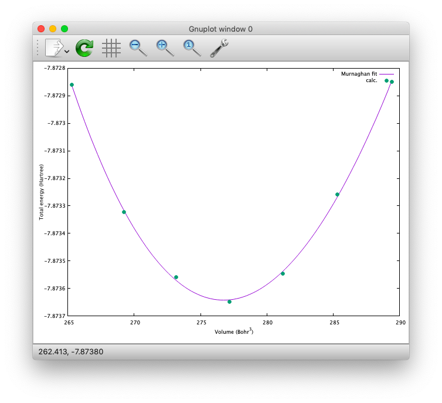

========
Examples
========

.. warning::
	This page is under construction

In this section how to run the STATE examples is described.
Download example files from `github <https://github.com/ikuhamada/state-examples>`_ and place them in an appropriate place, say, ``${HOME}/STATE``
See below for the example used in the Computational Materials Densing workshop

.. toctree::
   :maxdepth: 1

   CMD/index.rst

Silicon
=======
How to perform a self-consistent field (SCF) calculation and cell (volume) optimization by using a crystalline silicon in the diamond structure as an example.

SCF
---
First in the ``Si/`` directory, let us create a symbolik link to the STATE executable as follows

.. code:: bash

  $ ln -s ${HOME}/STATE/src/state-5.6.6/src/STATE

and that to the pseudopotential

.. code:: bash

  $ ln -s ${HOME}/STATE/gncpp/pot_Si.pbe1

Here we are going to use the input file ``nfinp_scf``.
Let us have a look at it by using the ``cat`` command as

.. code:: bash

  $ cat nfinp_scf

then we get the following::

  #
  # Crystalline silicon in the diamond structure
  #
  WF_OPT    DAV
  NTYP      1
  NATM      2
  TYPE      2
  NSPG      227
  GMAX      4.00
  GMAXP     8.00
  KPOINT_MESH    8  8  8
  KPOINT_SHIFT   1  1  1
  WIDTH     0.0002
  EDELTA    0.5000D-09
  NEG    8
  CELL   10.30  10.30  10.30  90.00  90.00  90.00
  &ATOMIC_SPECIES
   Si 28.0900 pot.Si_pbe1
  &END
  &ATOMIC_COORDINATES CRYSTAL
        0.000000000000      0.000000000000      0.000000000000    1    1    1
        0.250000000000      0.250000000000      0.250000000000    1    1    1
  &END

By default wave function optimization (single-point calculation) is performed (``WF_OPT``) with the Davidson algorithm (``DAV``), and structural optimization is not performed.
By using the above input file, we perform the SCF calculation as:

.. code:: bash

  $ mpirun -np 8 ./STATE < nfinp_scf > nfout_scf

The convergence of the total energy can be monitored by executing:

.. code:: bash

  $ grep ETOT\: nfout_scf

The result looks like::

  ETOT:   1     -6.05513096  0.6055E+01  0.3203E-02
  ETOT:   2     -7.84013758  0.1785E+01  0.5062E-02
  ETOT:   3     -7.87244596  0.3231E-01  0.4562E-02
  ETOT:   4     -7.87086756  0.1578E-02  0.7631E-02
  ETOT:   5     -7.87352176  0.2654E-02  0.1347E-02
  ETOT:   6     -7.87351941  0.2353E-05  0.5637E-03
  ETOT:   7     -7.87353730  0.1789E-04  0.4039E-03
  ETOT:   8     -7.87355183  0.1454E-04  0.2115E-03
  ETOT:   9     -7.87355489  0.3060E-05  0.1543E-03
  ETOT:  10     -7.87355832  0.3425E-05  0.9595E-05
  ETOT:  11     -7.87355833  0.9310E-08  0.4565E-05
  ETOT:  12     -7.87355833  0.2934E-08  0.1970E-05
  ETOT:  13     -7.87355833  0.5746E-09  0.1771E-06
  ETOT:  14     -7.87355833  0.1131E-10  0.1097E-06
  ETOT:  15     -7.87355833  0.9033E-12  0.5407E-07

Converged total energy and its componets are printed as::

                       TOTAL ENERGY AND ITS COMPONENTS 
                    TOTAL ENERGY     =          -7.87355833 A.U.
                  KINETIC ENERGY     =           3.01922477 A.U.
                  HARTREE ENERGY     =           0.55014239 A.U.
                       XC ENERGY     =          -2.40098667 A.U.
                    LOCAL ENERGY     =          -0.84295028 A.U.
                 NONLOCAL ENERGY     =           0.16885308 A.U.
                    EWALD ENERGY     =          -8.36784162 A.U.
                       PC ENERGY     =           0.00000000 A.U.
                 ENTROPIC ENERGY     =           0.00000000 A.U.

NOTE this message is NOT printed when the convergence is not achieved.

In addition, total density of states (DOS) is printed to ``dos.data``, which can be plotted with, for instantce, ``gnuplot`` as

.. code:: bash

  $ gnuplot

.. code :: bash

  $ gnuplot> set xrange [-12.5:7.5]
  $ gnuplot> set yrange [0:2.0]
  $ gnuplot> set xlabel 'Energy (eV)'
  $ gnuplot> set ylabel 'DOS (arb. unit)'
  $ gnuplot> plot 'dos.data' w l

The resulting DOS looks as follows:

.. image:: ../img/dos_si_raw.png
   :scale: 80%
   :align: center

Cell optimization
-----------------
In the current version of STATE, the stress tensor is not (yet!) calculated, and the cell optimization should be performed manually.
Let us change the lattice constant from 10.10 Bohr to 10.50 Bohr by 0.05 Bohr by changing the input variable ``CELL``

.. code:: bash

  CELL   10.10  10.10  10.10  90.00  90.00  90.00

.. code:: bash

  CELL   10.15  10.15  10.15  90.00  90.00  90.00

...

.. code:: bash

  CELL   10.50  10.50  10.50  90.00  90.00  90.00

For each lattice constant we prepare an input file as ``nfinp_scf_10.10``, ``nfinp_scf_10.15``, ... ``nfinp_scf_10.50`` and execute STATE

.. code:: bash

  $ mpirun -np 8 < nfinp_scf_10.10 > nfout_scf_10.10

.. code:: bash

  $ mpirun -np 8 < nfinp_scf_10.15 > nfout_scf_10.15

...

.. code:: bash

  $ mpirun -np 8 < nfinp_scf_10.50 > nfout_scf_10.50

To collect the volume-energy (E-V) data, here we use ``state2ev.sh`` script in ``state-5.6.6/util/`` as

.. code:: bash

  $ state2ev.sh nfout_scf_* > etot.dat

This can be visualized by using, for example, ``gnuplot`` as

.. code:: bash

  $ gnuplot

.. code:: gnuplot

  $ gnuplot> plot 'etot.dat' pt 7

The output looks like

.. image:: ../img/etot_si_raw.png
   :scale: 80%
   :align: center

Furthermore, by using the ``eosfit`` in the ``util`` directory, the equilibrium volume is obitained:

The equilibrium volume (v0), energy (e0), bulk modulus (b0), and derivative of bulk modulus (b0') can be found in ``eosfit.param``.
The resulting equilibrium lattice constant is 10.3455 Bohr.
Compare with that reported in the literature.

Aluminum
========
In this example, how to deal with a metallic system with the smearing method is briefly described by using the crystalline aluminium in the face centered cubic (fcc) structure.

SCF
---
In the ``Al`` directory, first prepare the pseudopotential as

.. code:: bash

  $ ln -s ${HOME}/STATE/gncpp/pot.Al_pbe1

and the STATE executable as

.. code:: bash

  $ ln -s ${HOME}/STATE/src/state-5.6.6/src/STATE

We use the following input file for the SCF calculation.

``nfinp_scf``::

  #
  # Crystalline aluminum in the face centered cubic structure
  #
  WF_OPT  DAV
  NTYP    1
  NATM    1
  TYPE    2
  NSPG    221
  GMAX    4.00
  GMAXP   8.00
  KPOINT_MESH   12 12 12
  KPOINT_SHIFT   1  1  1
  SMEARING MP
  WIDTH   0.0020
  EDELTA  0.5000D-09
  NEG     6
  CELL    7.50000000   7.50000000   7.50000000  90.00000000  90.00000000  90.00000000
  &ATOMIC_SPECIES
  Al 26.9815386 pot.Al_pbe1
  &END
  &ATOMIC_COORDINATES CRYSTAL
        0.000000000000      0.000000000000      0.000000000000    1    0    1
  &END

Here we set the smearing function of Methefessel and Paxton (MP) as

.. code:: bash

  SMEARING MP

and smearing width

.. code:: bash

  WIDTH  0.0020

We can also use negative ``WIDTH`` without explicitly specifying ``SMEARING`` to enable the smearing function.
In this case the MP smearing function is automatically set.
See the manual for the available smearing functions.

Execution of STATE is done as

.. code:: bash

  $ mpirun -np 8 ./STATE < nfinp_scf > nfout_scf

Total energy of the metallic system is sensitive to the smearing function and width, and the number of k-points, and they should be determined very carefully before the production run.
Detail is discussed in the tutorial (to be completed).

Nickel
======

This example shows how to perform a calculation of a spin-polarized system using the ferromagnetic Ni in the fcc structure.

Prep.
-----

* STATE

.. code:: bash

  $ ln -s ${HOME}/STATE/src/state-5.6.6/src/STATE

* Pseudopotential ``pot.Ni_pbe4``

.. code:: bash

  $ ln -s ${HOME}/STATE/gncpp/pot.Ni_pbe4

* Input file (``nfinp_scf``)

.. code:: bash

  #
  # Ferromagnetic Ni in the fcc structure
  #
  WF_OPT DAV
  NTYP   1
  NATM   1
  TYPE   2
  NSPG   221
  GMAX    5.00
  GMAXP  15.00
  KPOINT_MESH   12 12 12
  KPOINT_SHIFT   1  1  1
  MIX_ALPHA 0.3
  SMEARING MP
  WIDTH  0.0020
  EDELTA 0.5000D-09
  NSPIN  2
  NBZTYP 102
  NEG    10
  CELL   6.70  6.70  6.70  90.00  90.00  90.00
  &ATOMIC_SPECIES
   Ni 58.6900 pot.Ni_pbe4
  &END
  &INITIAL_ZETA
   0.20 
  &END
  &ATOMIC_COORDINATES CRYSTAL
        0.000000000000      0.000000000000      0.000000000000    1    1    1
  &END

To allow the spin polarized calculation, one has to set

.. code:: bash

  NSPIN 2

along with the initial magnetization as

.. code:: bash

  &INITIAL_ZETA
   0.20
  &END

for each atomic species.

SCF run
-------

.. code:: bash

  $ mpirun -np ./STATE < nfinp_scf > nfout_scf

Ethylene
========

This example explains how to perform the geometry optimization.

Prep.
-----

* STATE

In the ``C2H4`` directory:

.. code:: bash

  $ ln -fs ${HOME}/STATE/src/state-5.6.6/src/STATE

* Pseudopotentials

.. code:: bash

  $ ln -s ${HOME}/STATE/gncpp/pot.C_pbe3
  $ ln -s ${HOME}/STATE/gncpp/pot.H_lda3

* Input file ``nfinp_gdiis``

.. code:: bash

  #
  # Ethylene molecule in a box: geometry optimization with the GDIIS method
  #
  WF_OPT  DAV
  GEO_OPT GDIIS
  NTYP   2
  NATM   6
  TYPE   0
  GMAX    5.00
  GMAXP  15.00
  MIX_ALPHA 0.8
  WIDTH   0.0010
  EDELTA  0.1000D-08
  NEG     10
  FMAX    0.5000D-03
  CELL   12.00  12.00  12.00  90.00  90.00  90.00
  &ATOMIC_SPECIES
   C  12.0107  pot.C_pbe3
   H   1.0079  pot.H_lda3
  &END
  &ATOMIC_COORDINATES CARTESIAN
        1.262722983300      0.000000000000      0.000000000000    1    1    1
        2.348328846800      1.753458668500      0.000000000000    1    1    2
        2.348328846800     -1.753458668500      0.000000000000    1    1    2
       -1.262722983300      0.000000000000      0.000000000000    1    1    1
       -2.348328846800      1.753458668500      0.000000000000    1    1    2
       -2.348328846800     -1.753458668500      0.000000000000    1    1    2
  &END
 
The keyword ``GEO_OPT`` is used to activate the geometry optimization.
In this example, GDIIS algorithm is employed as::

  GEO_OPT GDIIS

The force threshold for the geometry optimization is set by the keyword ``FMAX`` as::

  FMAX    0.5000D-03

Geometry optimization
---------------------

.. code:: bash

  $ mpirun -np 8 ./STATE < nfinp_gdiis > nfout_gdiis

The convergence of the forces can be monitored by:

.. code:: bash

  $ grep -A1 f_max nfout_gdiis

The result looks like::

     NIT     TotalEnergy     f_max     f_rms      edel      vdel      fdel
       1    -13.90231646  0.001396  0.001303  0.13D-08  0.59D-07  0.13D-08
  --
     NIT     TotalEnergy     f_max     f_rms      edel      vdel      fdel
       2    -13.90232125  0.001296  0.001109  0.45D-09  0.47D-07  0.45D-09
  --
     NIT     TotalEnergy     f_max     f_rms      edel      vdel      fdel
       3    -13.90233075  0.000965  0.000788  0.27D-09  0.13D-06  0.27D-09
  --
     NIT     TotalEnergy     f_max     f_rms      edel      vdel      fdel
       4    -13.90234041  0.000562  0.000459  0.17D-08  0.25D-06  0.17D-08
  --
     NIT     TotalEnergy     f_max     f_rms      edel      vdel      fdel
       5    -13.90234848  0.000329  0.000271  0.11D-09  0.91D-07  0.11D-09

The latest geometry is stored in the ``GEOMETRY`` file, and in the case of GDIIS, past geometries are stored in ``gdiis.data``.
It is suggested that ``gdiis.data`` be deleted or renamed when the number of optimization steps is close to the number of degrees of freedom.

Vibrational analyis
-------------------

Having obtained the optimized geometry, let us perform the vibrational (normal) mode analysis.
This can be done in the following steps.

Frist, we need to create an input file with the optimized geometry.
This can be done by using a utility ``geom2nfinp`` as

.. code:: bash

  $ geom2nfinp -i nfinp_gdiis -g GEOMETRY -o nfinp_relaxed

where input parameters from ``nfinp_gdiis`` and atomic positions from ``GEOMETRY`` are used to create a new input file ``nfinp_relaxed``. 
``geom2nfinp`` can also be used to generate an XYZ/XSF file from the optimized geometry.
Type ``geom2nfinp -h`` for the usage of the command.

Then we copy ``nfinp_relaxed`` to ``nfinp_vib`` which looks like::

  #
  # Ethylene molecule in a box: geometry optimization with the GDIIS method
  #
  TASK   VIB
  WF_OPT DAV
  NTYP   2
  NATM   6
  TYPE   0
  GMAX    5.00
  GMAXP  15.00
  MIX_ALPHA 0.8
  WIDTH   0.0010
  EDELTA  0.1000D-08
  NEG     10
  FMAX    0.5000D-03
  CELL   12.00  12.00  12.00  90.00  90.00  90.00
  &ATOMIC_SPECIES
   C  12.0107  pot.C_pbe3
   H   1.0079  pot.H_lda3
  &END
  &ATOMIC_COORDINATES CARTESIAN
        1.260767348060     -0.000000889176      0.000000061206    1    1    1
        2.337934105040      1.755199776368      0.000000035554    1    1    2
        2.337933682371     -1.755198581491      0.000000037135    1    1    2
       -1.260766004354     -0.000000071340      0.000000050715    1    1    1
       -2.337933757669      1.755199342527      0.000000064907    1    1    2
       -2.337933482763     -1.755199042963      0.000000067944    1    1    2
  &END

We can see the new keyword ``TASK VIB``, which enables one to perform the vibrational analysis.

.. note::

  Make sure the atomic masses in the input file are those you want to use as
  in some cases we use artificially large/small atomic masses for efficient structural optimization.

In addition to the input file, we need prepare ``nfvibrate.data`` as::

      1  0.10D+01   1
       1   0.0100000000   0.0000000000   0.0000000000
      1 -0.10D+01   1
       1   0.0100000000   0.0000000000   0.0000000000
      1  0.10D+01   2
       1   0.0000000000   0.0100000000   0.0000000000
      1 -0.10D+01   2
       1   0.0000000000   0.0100000000   0.0000000000
      1  0.10D+01   3
       1   0.0000000000   0.0000000000   0.0100000000
      1 -0.10D+01   3
       1   0.0000000000   0.0000000000   0.0100000000
      ...
      1  0.10D+01  16
       6   0.0100000000   0.0000000000   0.0000000000
      1 -0.10D+01  16
       6   0.0100000000   0.0000000000   0.0000000000
      1  0.10D+01  17
       6   0.0000000000   0.0100000000   0.0000000000
      1 -0.10D+01  17
       6   0.0000000000   0.0100000000   0.0000000000
      1  0.10D+01  18
       6   0.0000000000   0.0000000000   0.0100000000
      1 -0.10D+01  18
       6   0.0000000000   0.0000000000   0.0100000000

In the present example, the file contains 2 x 2 x 6 x 3 = 72 lines, which define the atomic displacement in the cartesian coordinate.
This is 36 set of displacement composed of 2 lines (in this case).
Here I use first two lines as an example:

First line

.. code:: bash

      1  0.10D+01   1

* First column : number of displacement(s)

* Second column : factor for the displacement

* Thrid column : dummy

Second line

.. code:: bash

       1   0.0100000000   0.0000000000   0.0000000000

* First column in the second line: the index for the atom displaced

* Second-Fourth column in the second line: atomic displacement in the cartesian coordinate.

Actual atomic displacements are atomic displacement (2-4th column in the second line multiplied by the factor).

Execute the following

.. code:: bash

  $ mpirun -np 8 ./STATE < nfinp_vib > nfout_vib

and we get ``nfforce.data`` in addition to the standard output files, which contains displaced atomic positions and forces acting on atoms, which can be used to calculate the vibrational frequencies.

Then to calculate the dynamical matrix and vibrational frequencies, we use the ``gif`` program as follows:

.. code:: bash

  $ gif -f nfforce.data

and we can see the vibrational frequncies printed in the standard output as:

.. code:: bash

               =========             
                SUMMARY              
               =========             
  
   MODE  WR       : NU(meV)  NU(cm-1)
      1 -0.42D-03 :   12.97    104.63
      2 -0.19D-03 :    8.76     70.63
      3 -0.61D-04 :    4.97     40.06
      4 -0.18D-04 :    2.67     21.50
      5  0.30D-04 :    3.46     27.93
      6  0.28D-03 :   10.71     86.35
      7  0.25D-01 :  100.48    810.43
      8  0.32D-01 :  114.17    920.88
      9  0.34D-01 :  116.25    937.60
     10  0.41D-01 :  128.26   1034.48
     11  0.55D-01 :  148.39   1196.82
     12  0.68D-01 :  165.42   1334.18
     13  0.76D-01 :  175.51   1415.54
     14  0.10D+00 :  201.49   1625.12
     15  0.36D+00 :  379.55   3061.29
     16  0.36D+00 :  381.80   3079.41
     17  0.37D+00 :  388.22   3131.17
     18  0.38D+00 :  393.55   3174.18

The first column, the number of mode, the second column, square of the vibrational frequency in Hartree, and third and fourth columns are vibrational frequencies in meV and wavenumber (cm^-1), respectively.

.. warning::
	New data are always appended to the exsiting ``nfforce.data``. Rename it when (a set of) calculations are finished.

Finally, we visualize the vibrational mode by using the ``gif2xsf`` utility.
To use ``gif2xsf`` we prepare an XSF, which can be created by using the ``chkinpf`` utility as:

.. code:: bash

  $ chkinpf --atom nfinp_vib

By this we are able to create an XSF file for molecule (not periodic boundary condition).
Then type

.. code:: bash

  $ gif2xsf -s

Use C2H4.xsf for the XSF file, vib.data for VIB file, and vib for prefix, and we get vib_*.xsf, which can be visualized by using XCrySden or VESTA.

Cl on Al(100)
=============

This example explains how to model the surface with an adsobate by using an Al(100) surface with a Cl atom.
We also discuss how the periodic boundary condition (PBC) affects the potential (and thus the energy and forces)
and how to address the issue by using the effective screening medium (ESM) method.

Prep.
-----

* STATE

In the ``ClonAl100`` directory

.. code:: bash

  $ ln -s ${HOME}/STATE/src/state-5.6.6/src/STATE

* Pseudopotentials

.. code:: bash

  $ ln -s ${HOME}/STATE/gncpp/pot_Al.pbe1

.. code:: bash

  $ ln -s ${HOME}/STATE/gncpp/pot_Cl.pbe1

Structural optimization with the periodic boundary condition
------------------------------------------------------------

We are going to use the following input file (``nfinp_gdiis_pbc``)::

  #
  # Cl on Al(100)
  #
  WF_OPT  DAV
  GEO_OPT GDIIS
  NTYP    2
  NATM    7
  NSPG    1
  GMAX    4.00
  GMAXP  10.00
  KPOINT_MESH    4  4  1
  KPOINT_SHIFT   2  2  1
  SMEARING  MP
  WIDTH     0.0020
  NEG       16
  MIX       BROYDEN2
  MIX_ALPHA 0.80
  EDELTA   1.000D-09
  DTIO     600.00
  FMAX     1.000D-03
  &ATOMIC_SPECIES
   Al  26.9815 pot.Al_pbe1
   Cl  35.4527 pot.Cl_pbe1
  &END
  &CELL
        7.653400000000      0.000000000000      0.000000000000
        0.000000000000      7.653000000000      0.000000000000
        0.000000000000      0.000000000000     30.613600000000
  &END
  &ATOMIC_COORDINATES CARTESIAN
        0.000000000000      0.000000000000      3.700000000000    1    1    2
        0.000000000000      3.826700000000      0.000000000000    1    1    1
        3.826700000000      0.000000000000      0.000000000000    1    1    1
        0.000000000000      0.000000000000     -3.826700000000    1    0    1
        3.826700000000      3.826700000000     -3.826700000000    1    0    1
        0.000000000000      3.826700000000     -7.653400000000    1    0    1
        3.826700000000      0.000000000000     -7.653400000000    1    0    1
  &END

We see that how to define the lattice vectors differs from the previous examples.

Run STATE by executing:

.. code:: bash

  $ mpirun -np 8 ./STATE < nfinp_gdiis_pbc > nfout_gdiis_pbc

and we get ``GEOMETRY`` and ``gdiis.data`` in addition to the standard output files.

Structural optimization with the effective screening medium method
------------------------------------------------------------------

We then use ``nfinp_gdiis_esm`` for the structural optimization with the effective screening medium method, which looks like::

  #
  # Cl on Al(100)
  #
  WF_OPT  DAV
  GEO_OPT GDIIS
  NTYP    2
  NATM    7
  NSPG    1
  GMAX    4.00
  GMAXP  10.00
  KPOINT_MESH    4  4  1
  KPOINT_SHIFT   2  2  1
  SMEARING  MP
  WIDTH     0.0020
  NEG       16
  MIX       BROYDEN2
  MIX_ALPHA 0.80
  EDELTA   1.000D-09
  DTIO     600.00
  FMAX     1.000D-03
  &ESM
   BOUNDARY_CONDITION BARE
  &END
  &ATOMIC_SPECIES
   Al  26.9815 pot.Al_pbe1
   Cl  35.4527 pot.Cl_pbe1
  &END
  &CELL
        7.653400000000      0.000000000000      0.000000000000
        0.000000000000      7.653000000000      0.000000000000
        0.000000000000      0.000000000000     30.613600000000
  &END
  &ATOMIC_COORDINATES CARTESIAN
        0.000000000000      0.000000000000      3.700000000000    1    1    2
        0.000000000000      3.826700000000      0.000000000000    1    1    1
        3.826700000000      0.000000000000      0.000000000000    1    1    1
        0.000000000000      0.000000000000     -3.826700000000    1    0    1
        3.826700000000      3.826700000000     -3.826700000000    1    0    1
        0.000000000000      3.826700000000     -7.653400000000    1    0    1
        3.826700000000      0.000000000000     -7.653400000000    1    0    1
  &END

Diffence from the previous calculation is ::

  &ESM
   BOUNDARY_CONDITION BARE
  &END

This enables the ESM calculation. 
In this case open boundary condition in the surface normal direction is used.

Analysis of the effective and electrostatic potentials
------------------------------------------------------

Here we analyze the potentials from PBC and ESM calculations.
Use ``state2chgpro.sh`` utility to extract planar average of charge, effective (Kohn-Sham) and electrostatic potentials as:

.. code:: bash

  $ state2chgpro.sh nfout_gdiis_pbc > chgpro.dat_pbc

By plotting the first and third colums, and first and fourth colums, we get the following potential profile:

.. image:: ../img/potential_profile_pbc.png
   :scale: 80%
   :align: center

We can see that the electric field is applied to the slab because of the periodic boundary condition.

We also extract the planar average of chargen and potential from the ESM calculations as:

.. code:: bash

  $ state2chgpro.sh nfout_gdiis_esm > chgpro.dat_esm

and we get the following:

.. image:: ../img/potential_profile_esm.png
   :scale: 80%
   :align: center

We can see that the potentials are flat in the vacuum region. Mind that the slab is locased near the origin (z=0). The discontinuity is by the plotting reason (actually they are disconnected because we do not use the periodic boundary condition with the ESM method). 
