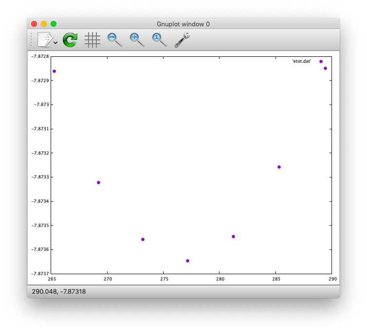

========
Examples
========

.. warning::
	This page is under construction

In this section how to run the STATE examples is described.
Download example files and place them in an appropriate place, say, ``${HOME}/STATE``

Silicon
=======
How to perform a self-consistent field (SCF) calculation and cell (volume) optimization by using a crystalline silicon in the diamond structure as an example.

SCF
---
First in the ``Si/`` directory, let us create a symbolik link to the STATE executable as follows

.. code:: bash

  $ ln -s ${HOME}/STATE/src/state-5.6.6/src/STATE

and that to the pseudopotential

.. code:: bash

  $ ln -s ${HOME}/STATE/gncpp/pot_Si.pbe1

Here we are going to use the input file ``nfinp_scf``.
Let us have a look at it by using the ``cat`` command as

.. code:: bash

  $ cat nfinp_scf

then we get the following::

  #
  # Crystalline silicon in the diamond structure
  #
  WF_OPT    DAV
  NTYP      1
  NATM      2
  TYPE      2
  NSPG      227
  GMAX      4.00
  GMAXP     8.00
  KPOINT_MESH    8  8  8
  KPOINT_SHIFT   1  1  1
  WIDTH     0.0002
  EDELTA    0.5000D-09
  NEG    8
  CELL   10.30  10.30  10.30  90.00  90.00  90.00
  &ATOMIC_SPECIES
   Si 28.0900 pot.Si_pbe1
  &END
  &ATOMIC_COORDINATES CRYSTAL
        0.000000000000      0.000000000000      0.000000000000    1    1    1
        0.250000000000      0.250000000000      0.250000000000    1    1    1
  &END

By default wave function optimization (single-point calculation) is performed (``WF_OPT``) with the Davidson algorithm (``DAV``), and structural optimization is not performed.
By using the above input file, we perform the SCF calculation as:

.. code:: bash

  $ mpirun -np 8 ./STATE < nfinp_scf > nfout_scf

The convergence of the total energy can be monitored by executing:

.. code:: bash

  $ grep ETOT\: nfout_scf

The result looks like::

  ETOT:   1     -6.05513096  0.6055E+01  0.3203E-02
  ETOT:   2     -7.84013758  0.1785E+01  0.5062E-02
  ETOT:   3     -7.87244596  0.3231E-01  0.4562E-02
  ETOT:   4     -7.87086756  0.1578E-02  0.7631E-02
  ETOT:   5     -7.87352176  0.2654E-02  0.1347E-02
  ETOT:   6     -7.87351941  0.2353E-05  0.5637E-03
  ETOT:   7     -7.87353730  0.1789E-04  0.4039E-03
  ETOT:   8     -7.87355183  0.1454E-04  0.2115E-03
  ETOT:   9     -7.87355489  0.3060E-05  0.1543E-03
  ETOT:  10     -7.87355832  0.3425E-05  0.9595E-05
  ETOT:  11     -7.87355833  0.9310E-08  0.4565E-05
  ETOT:  12     -7.87355833  0.2934E-08  0.1970E-05
  ETOT:  13     -7.87355833  0.5746E-09  0.1771E-06
  ETOT:  14     -7.87355833  0.1131E-10  0.1097E-06
  ETOT:  15     -7.87355833  0.9033E-12  0.5407E-07

Converged total energy and its componets are printed as::

                       TOTAL ENERGY AND ITS COMPONENTS 
                    TOTAL ENERGY     =          -7.87355833 A.U.
                  KINETIC ENERGY     =           3.01922477 A.U.
                  HARTREE ENERGY     =           0.55014239 A.U.
                       XC ENERGY     =          -2.40098667 A.U.
                    LOCAL ENERGY     =          -0.84295028 A.U.
                 NONLOCAL ENERGY     =           0.16885308 A.U.
                    EWALD ENERGY     =          -8.36784162 A.U.
                       PC ENERGY     =           0.00000000 A.U.
                 ENTROPIC ENERGY     =           0.00000000 A.U.

NOTE this message is NOT printed when the convergence is not achieved.

In addition, total density of states (DOS) is printed to ``dos.data``, which can be plotted with, for instantce, ``gnuplot`` as

.. code:: bash

  $ gnuplot

.. code :: bash

  $ gnuplot> set xrange [-12.5:7.5]
  $ gnuplot> set yrange [0:2.0]
  $ gnuplot> set xlabel 'Energy (eV)'
  $ gnuplot> set ylabel 'DOS (arb. unit)'
  $ gnuplot> plot 'dos.data' w l

The resulting DOS looks as follows:

.. image:: ../img/dos_si_raw.png
   :scale: 80%
   :align: center

Cell optimization
-----------------
In the current version of STATE, the stress tensor is not (yet!) calculated, and the cell optimization should be performed manually.
Let us change the lattice constant from 10.10 Bohr to 10.50 Bohr by 0.05 Bohr by changing the input variable ``CELL``

.. code:: bash

  CELL   10.10  10.10  10.10  90.00  90.00  90.00

.. code:: bash

  CELL   10.15  10.15  10.15  90.00  90.00  90.00

...

.. code:: bash

  CELL   10.50  10.50  10.50  90.00  90.00  90.00

For each lattice constant we prepare an input file as ``nfinp_scf_10.10``, ``nfinp_scf_10.15``, ... ``nfinp_scf_10.50`` and execute STATE

.. code:: bash

  $ mpirun -np 8 < nfinp_scf_10.10 > nfout_scf_10.10

.. code:: bash

  $ mpirun -np 8 < nfinp_scf_10.15 > nfout_scf_10.15

...

.. code:: bash

  $ mpirun -np 8 < nfinp_scf_10.50 > nfout_scf_10.50

To collect the volume-energy (E-V) data, here we use ``state2ev.sh`` script in ``state-5.6.6/util/`` as

.. code:: bash

  $ state2ev.sh nfout_scf_* > etot.dat

This can be visualized by using, for example, ``gnuplot`` as

.. code:: bash

  $ gnuplot

.. code:: gnuplot

  $ gnuplot> plot 'etot.dat' pt 7

The output looks like

Furthermore, by using the ``eosfit`` in the ``util`` directory, the equilibrium volume is obitained:

The equilibrium volume (v0), energy (e0), bulk modulus (b0), and derivative of bulk modulus (b0') can be found in ``eosfit.param``.
The resulting equilibrium lattice constant is 10.3455 Bohr.
Compare with that reported in the literature.

Aluminum
========
In this example, how to deal with a metallic system with the smearing method is briefly described by using the crystalline aluminium in the face centered cubic (fcc) structure.

SCF
---
In the ``Al`` directory, first prepare the pseudopotential as

.. code:: bash

  $ ln -s ${HOME}/STATE/gncpp/pot.Al_pbe1

and the STATE executable as

.. code:: bash

  $ ln -s ${HOME}/STATE/src/state-5.6.6/src/STATE

We use the following input file for the SCF calculation.

``nfinp_scf``::

  #
  # Crystalline aluminum in the face centered cubic structure
  #
  WF_OPT  DAV
  NTYP    1
  NATM    1
  TYPE    2
  NSPG    221
  GMAX    4.00
  GMAXP   8.00
  KPOINT_MESH   12 12 12
  KPOINT_SHIFT   1  1  1
  SMEARING MP
  WIDTH   0.0020
  EDELTA  0.5000D-09
  NEG     6
  CELL    7.50000000   7.50000000   7.50000000  90.00000000  90.00000000  90.00000000
  &ATOMIC_SPECIES
  Al 26.9815386 pot.Al_pbe1
  &END
  &ATOMIC_COORDINATES CRYSTAL
        0.000000000000      0.000000000000      0.000000000000    1    0    1
  &END

Here we set the smearing function of Methefessel and Paxton (MP) as

.. code:: bash

  SMEARING MP

and smearing width

.. code:: bash

  WIDTH  0.0020

We can also use negative ``WIDTH`` to enable the smearing function.
In this case the MP smearing function is automatically set.
See the manual for the available smearing functions.

Execution of STATE is done as

.. code:: bash

  $ mpirun -np 8 ./STATE < nfinp_scf > nfout_scf

Total energy of the metallic system is sensitive to the smearing function and width, and the number of k-points, and they should be determined very carefully before the production run.
Detail is discussed in the tutorial (to be completed).

Nickel
======

This example shows how to perform a calculation of a spin-polarized system using the ferromagnetic Ni in the fcc structure.

Prep.
-----

* STATE

.. code:: bash

  $ ln -s ${HOME}/STATE/src/state-5.6.6/src/STATE

* Pseudopotential ``pot.Ni_pbe4``

.. code:: bash

  $ ln -s ${HOME}/STATE/gncpp/pot.Ni_pbe4

* Input file (``nfinp_scf``)

.. code:: bash

  #
  # Ferromagnetic Ni in the fcc structure
  #
  WF_OPT DAV
  NTYP   1
  NATM   1
  TYPE   2
  NSPG   221
  GMAX    5.00
  GMAXP  15.00
  KPOINT_MESH   12 12 12
  KPOINT_SHIFT   1  1  1
  MIX_ALPHA 0.3
  SMEARING MP
  WIDTH  0.0020
  EDELTA 0.5000D-09
  NSPIN  2
  NBZTYP 102
  NEG    10
  CELL   6.70  6.70  6.70  90.00  90.00  90.00
  &ATOMIC_SPECIES
   Ni 58.6900 pot.Ni_pbe4
  &END
  &INITIAL_ZETA
   0.20 
  &END
  &ATOMIC_COORDINATES CRYSTAL
        0.000000000000      0.000000000000      0.000000000000    1    1    1
  &END

To allow the spin polarized calculation, one has to set

.. code:: bash

  NSPIN 2

along with the initial magnetization as

.. code:: bash

  &INITIAL_ZETA
   0.20
  &END

for each atomic species.

SCF run
-------

.. code:: bash

  $ mpirun -np ./STATE < nfinp_scf > nfout_scf

Ethylene
========

This example explains how to perform the geometry optimization.

Prep.
-----

* STATE

.. code:: bash

  $ ln -fs ${HOME}/STATE/src/state-5.6.6/src/STATE

* Pseudopotentials

.. code:: bash

  $ ln -s ${HOME}/STATE/gncpp/pot.C_pbe3
  $ ln -s ${HOME}/STATE/gncpp/pot.H_lda3

* Input file ``nfinp_gdiis``

.. code:: bash

  #
  # Ethylene molecule in a box: geometry optimization with the GDIIS method
  #
  WF_OPT  DAV
  GEO_OPT GDIIS
  NTYP   2
  NATM   6
  TYPE   0
  GMAX    5.00
  GMAXP  15.00
  MIX_ALPHA 0.8
  WIDTH   0.0010
  EDELTA  0.1000D-08
  NEG     10
  FMAX    0.5000D-03
  CELL   12.00  12.00  12.00  90.00  90.00  90.00
  &ATOMIC_SPECIES
   C  12.0107  pot.C_pbe3
   H   1.0079  pot.H_lda3
  &END
  &ATOMIC_COORDINATES CARTESIAN
        1.262722983300      0.000000000000      0.000000000000    1    1    1
        2.348328846800      1.753458668500      0.000000000000    1    1    2
        2.348328846800     -1.753458668500      0.000000000000    1    1    2
       -1.262722983300      0.000000000000      0.000000000000    1    1    1
       -2.348328846800      1.753458668500      0.000000000000    1    1    2
       -2.348328846800     -1.753458668500      0.000000000000    1    1    2
  &END
 
The keyword ``GEO_OPT`` is used to activate the geometry optimization.
In this example, GDIIS algorithm is employed as::

  GEO_OPT GDIIS

The force threshold for the geometry optimization is set by the keyword ``FMAX`` as::

  FMAX    0.5000D-03

Geometry optimization
---------------------

.. code:: bash

  $ mpirun -np 8 ./STATE < nfinp_gdiis > nfout_gdiis

The latest geometry is stored in the ``GEOMETRY`` file, and in the case of GDIIS, past geometries are stored in ``gdiis.data``.
It is suggested that ``gdiis.data`` be deleted or renamed when the number of optimization steps is close to the number of degrees of freedom.

Cl on Al(100)
=============

Structural optimization
-----------------------
