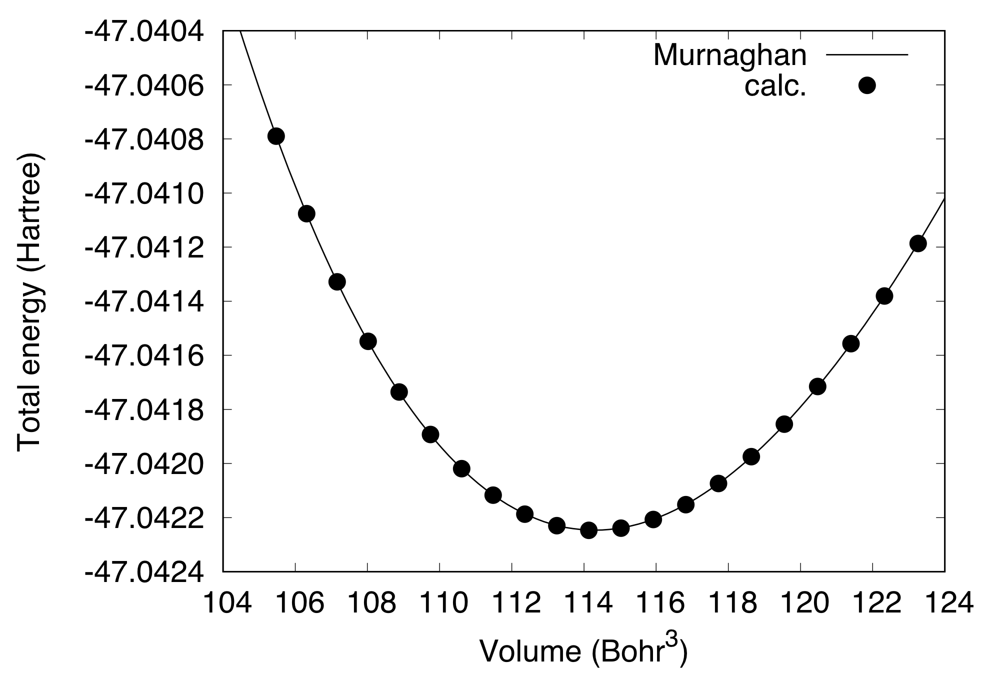
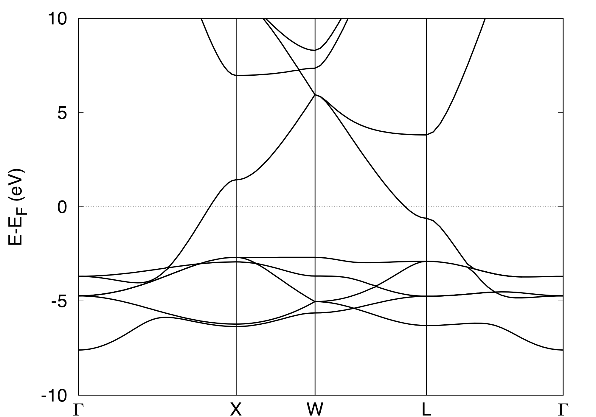
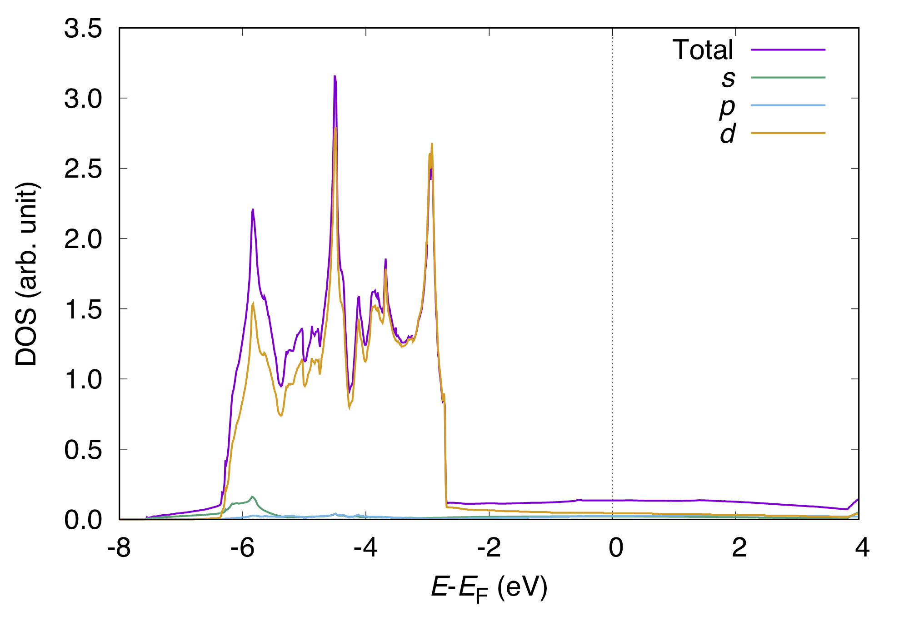
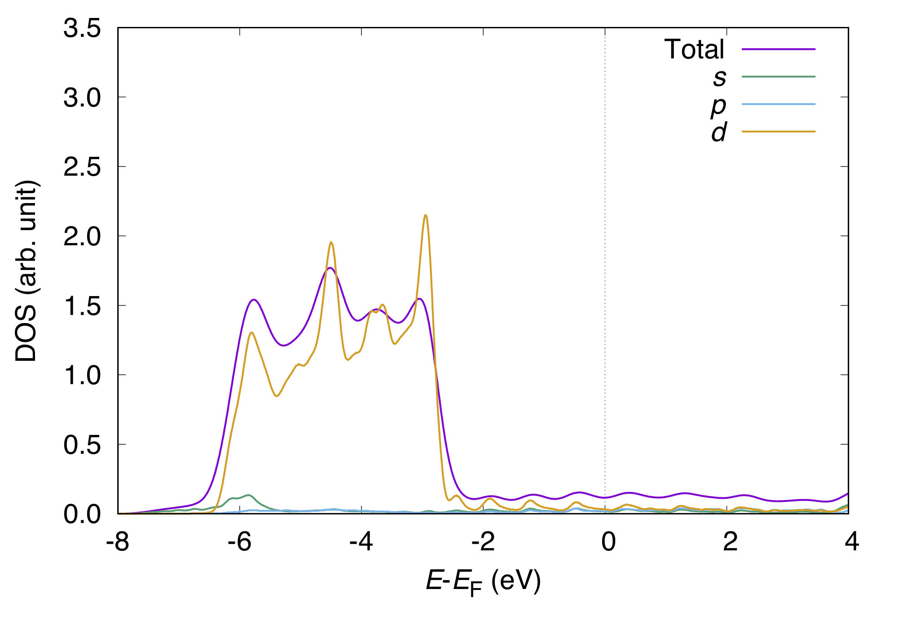

.. _tutorial_ag:

:orphan:

Crystalline silver
==================
This tutorial explains a set of calculations for crystalline silver in the fcc structure, including

- Cell optimization
- Band structure
- Density of states

We use the ``pot.Ag_pbe1`` pseudopotential and the cutoff energy of 36 (400) Ry for the wave functions (augmented charge).
The Brillouin zone sampling is done with the shifted 24x24x24 k-point grid.

The general input file for this section is as follows::

  WF_OPT    DAV
  NTYP      1
  NATM      1
  TYPE      2
  NSPG      221
  GMAX      6.0
  GMAXP     20.0
  KPOINT_MESH  24 24 24
  KPOINT_SHIFT ON  ON  ON
  SMEARING  MP
  WIDTH     0.0010
  EDELTA    1.0000D-10
  NEG       24
  CELL      7.70356187   7.70356187   7.70356187   90.00  90.00  90.00
  &ATOMIC_SPECIES
   Ag 107.8682 pot.Ag_pbe1
  &END
  &ATOMIC_COORDINATES CRYSTAL
        0.000000000000      0.000000000000      0.000000000000    1    1    1
  &END

Cell optimization
-----------------
First, we calculate the total energy as a function of lattice parameter (or volume), fit it to the Murnaghan equation of state, to obtain the equilbrium lattice constant of 7.704 Bohr (4.077 Angstrom).

Band structure calculation
--------------------------
The band structure can be calculated by performing an SCF calculation to obtain the self-consistent charge density, and by performing non-SCF calculation at given k-points along the high symmetry lines in the Brillouin zone.
An input file for the band structure may look like::

  TASK      BAND
  WF_OPT    DAV
  NTYP      1
  NATM      1
  TYPE      2
  NSPG      221
  GMAX      6.0
  GMAXP     20.0
  KPOINT_MESH  24 24 24
  KPOINT_SHIFT ON  ON  ON
  SMEARING  MP
  WIDTH     0.0010
  EDELTA    1.0000D-10
  NEG       24
  CELL      7.70356187   7.70356187   7.70356187   90.00  90.00  90.00
  &ATOMIC_SPECIES
   Ag 107.8682 pot.Ag_pbe1
  &END
  &ATOMIC_COORDINATES CRYSTAL
        0.000000000000      0.000000000000      0.000000000000    1    1    1
  &END
  &KPOINTS_BAND
   NKSEG 4
   KMESH 40 20 20 20
   KPOINTS
   0.000 0.000 0.000
   0.000 0.500 0.500
   0.250 0.500 0.750
   0.500 0.500 0.500
   0.000 0.000 0.000
  &END

The band structure calculation is performed by using the keyword ``TASK`` as::

  TASK      BAND

and the k-points along the high symmetry lines can be specified as::

  &KPOINTS_BAND
   NKSEG 4
   KMESH 40 20 20 20
   KPOINTS
   0.000 0.000 0.000
   0.000 0.500 0.500
   0.250 0.500 0.750
   0.500 0.500 0.500
   0.000 0.000 0.000
  &END

Here, the number of k-point segments is defined by::

   NKSEG 4

followed by the k-point mesh for each segment::

   KMESH 40 20 20 20

and by the high symmetry k-points in the crystal coordinate (in the unit of the reciprocal lattice vectors), which define the k-point segment as::

   KPOINTS
   0.000 0.000 0.000
   0.000 0.500 0.500
   0.250 0.500 0.750
   0.500 0.500 0.500
   0.000 0.000 0.000

The number of k-points should be NKSEG+1.
The k-points in the cartesian coordinate and the eigenvalues are printed to ``energy.data``, but it cannot be plotted as it is.
Use a utility ``energy2band`` to generate a data that can be visualized directory.

Type

.. code:: bash

 $ energy2band

and the number of bands and the number of k-points are asked.
The origin of the energy is also asked, for which the Fermi level in the previous SCF calculation (for metallic systems) or the valence band maximum (for insulating systems) is often used.
When ``energy2band`` is successfully terminated, ``band.data`` is created, which can be visualized by using gnuplot or xmgrace.

The calculated band structure can be drawn as:

Density of states calculation
-----------------------------
Total density of states is printed to ``dos.data`` by default.
For a nonmagnetic system (``NSPIN 1``), the content of data is:

* 1st column: energy 
* 2nd column: density of states (tetrahedron)
* 3rd column: density of states (Gaussian broadening)

The input file for the calculation of densities of states (PDOSs) projected onto the atomic orbitals looks like::

  WF_OPT    DAV
  NTYP      1
  NATM      1
  TYPE      2
  NSPG      221
  GMAX      6.0
  GMAXP     20.0
  KPOINT_MESH  24 24 24
  SMEARING  MP
  WIDTH     0.0010
  EDELTA    1.0000D-10
  NEG       24
  CELL      7.70356187   7.70356187   7.70356187   90.00  90.00  90.00
  &ATOMIC_SPECIES
   Ag 107.8682 pot.Ag_pbe1
  &END
  &ATOMIC_COORDINATES CRYSTAL
        0.000000000000      0.000000000000      0.000000000000    1    1    1
  &END
  &PDOS
   NPDOSAO 1
   IPDOST  1
   EMIN    -15.00
   EMAX      5.00
   EWIDTH    0.10
   NPDOSE  2001
   RCUT    2.00
   RWIDTH  0.10
  &END

To perfrom the density of state calculation, we put the block ``&PDOS...&END``::

  &PDOS
   NPDOSAO 1
   IPDOST  1
   EMIN    -15.00
   EMAX      5.00
   EWIDTH    0.10
   NPDOSE  2001
   RCUT    2.00
   RWIDTH  0.10
  &END

See the manual for the description of the block.

The projected density of states is printed to the standard output with the keyword (``STATE``), which can be extracted by running the ``state2pdos.pl`` script as :

.. code:: bash

  $ state2pdos.pl [STATE output]

PDOS is written to ``pdos_*.data``.
The order of PDOS is as follows::

   energy      s     px     py     pz    dzz dxx-yy    dxy    dyz    dzx

This can be visualized as:

We can also calculate PDOS with Gaussian.
In such a case, use

.. code:: bash

  GAUSSDOS

in the ``&PDOS...&END`` block or add the following block in the input file:

.. code:: bash

  &OTHERS
   GAUSSDOS
  &END

The (smeared) DOS may look like:

Note for the total density of states, the smearing width used in the SCF calculation ``WIDTH`` is used.
