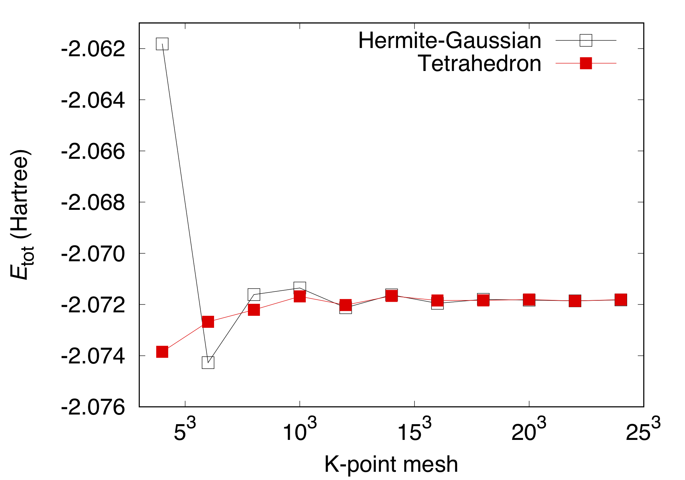
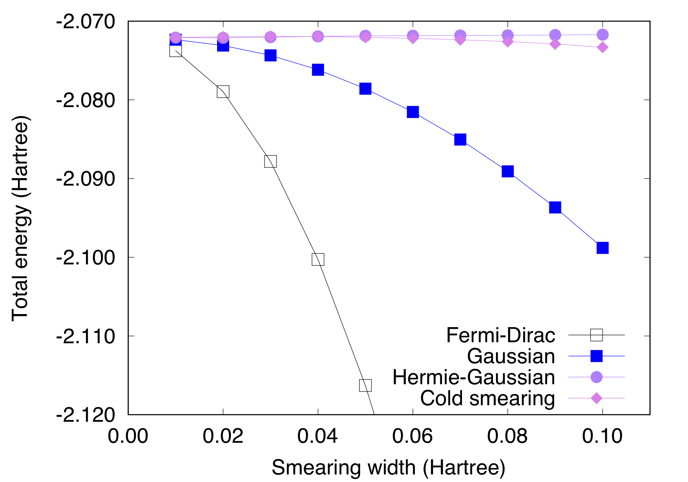

.. _tutorial_al:

:orphan:

Crystalline Aluminum
====================
This tutorial explains how to perform the convergence study with respect to the number of k-points with the smearing and tetrahedron methods.
This also shows that the total energy depends significantly on the smearing function and width.

Convergence with respect to the number of k-points
--------------------------------------------------
We present the convergence of the total energy with respect to the number of k-points with the Methefeesel-Paxton smearing (default) and tetrahedron methods.
Use the keyword ``SMEARING`` to choose the smearing function to treat the Fermi level for metallic systems.
A typical input file for aluminum in the fcc structure is::

  WF_OPT DAV
  NTYP   1
  NATM   1
  TYPE   2
  NSPG   225
  GMAX   4.00
  KPOINT_MESH  4  4  4
  MIX_ALPHA    0.6
  SMEARING MP
  WIDTH    0.0200
  EDELTA   1.000D-10
  NEG      6
  CELL    7.59670000   7.59670000   7.59670000  90.00000000  90.00000000  90.00000000
  &ATOMIC_SPECIES
   Al  26.980000 pot.Al_pbe1
  &END
  &ATOMIC_COORDINATES CRYSTAL
        0.000000000000      0.000000000000      0.000000000000    1    1    1
  &END

Use ``BZINT TETRA`` to use the tetrahedron method (we haven't tested if both ``BZINT`` and ``SMEARING`` exist in the input file).

Total energy as a function of k-point mesh for smearing method (Hermite-Gaussian) and tetrahedron method are obtained as follows:

Smearing method::

  #K-point mesh Etot(Hartree)
   4  4  4      -2.06181805
   6  6  6      -2.07427411
   8  8  8      -2.07161451
  10 10 10      -2.07135505
  12 12 12      -2.07212484
  14 14 14      -2.07162406
  16 16 16      -2.07195589
  18 18 18      -2.07179717
  20 20 20      -2.07182881
  22 22 22      -2.07185750
  24 24 24      -2.07182100

Tetrahedron method::

  #K-point mesh Etot(Hartree)
   4  4  4      -2.07385026
   6  6  6      -2.07267588
   8  8  8      -2.07220663
  10 10 10      -2.07168189
  12 12 12      -2.07202169
  14 14 14      -2.07166456
  16 16 16      -2.07184510
  18 18 18      -2.07184080
  20 20 20      -2.07180786
  22 22 22      -2.07186279
  24 24 24      -2.07180814

.. warning::
 The k-point shift should be switched off for the tetrahedron method.

Convergence with respect to the smearing width
----------------------------------------------
Total (free) energy of the metallic system is sensitive to the smearing width, in particular, with the Gaussian and Fermi-Dirac function.
We demonstrate the smearing width dependence of the total energy, following the seminal work by de Gironcoli [1]_.

We calculate the total energy as a function of smearing width by using different smearing function (Fermi-Dirac ``FD``, Gaussian ``GA``, Hermite-Gaussian of the order one of Methfessel-Paxton ``MP``, and cold smearing of Marzari-Vanderbilt ``MV``), as shown below.
A cutoff wave vector of 4 and a non-shifted 12x12x12 k-point grid are used.

We can see that the total energy depends significantly on the smearing width with Fermi-Dirac and Gaussian, whereas the total energy is not sensitive to the width with Hermite-Gaussian and cold smearing.

.. [1] S. de Gironcoli, Phys. Rev. B **51**, 6773(R) (1995).
