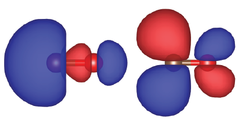

.. _tutorial_co:

Carbon monooxide
================
In this example, how to draw molecular orbital(s) is explained by taking a carbon monooxide (CO) molecule as an example.

Structural optimization
-----------------------
To start off, we first optimize the structure by using the quenched molecular dynamics (QMD) using the following input file (``nfinp_opt``)::

  WF_OPT    DAV
  GEO_OPT   QMD
  NTYP      2
  NATM      2
  GMAX      6.00
  GMAXP     20.00
  MIX_ALPHA 0.7
  WIDTH     0.0010
  EDELTA    1.D-09
  NEG       8
  FMAX      1.D-3
  CELL   15.00000000  15.00000000  15.00000000  90.00000000  90.00000000  90.00000000
  &ATOMIC_SPECIES
   C  12.011  pot.C_pbe1
   O  15.999  pot.O_pbe1
  &END
  &ATOMIC_COORDINATES CARTESIAN
        0.000000000000      0.000000000000      0.000000000000    1    1    1
        2.200000000000      0.000000000000      0.000000000000    1    1    2
  &END

Run STATE and confirm that the structural optimization is successfully finished by inspecting the input file (``nfuot_opt``) by:

.. code:: bash

 $ grep -A1 f_max nfout_opt

Then you may get the following::

     NIT     TotalEnergy     f_max     f_rms      edel      vdel      fdel
       1    -22.28228624  0.032705  0.032674  0.13D-09  0.24D-07  0.13D-09
  --
     NIT     TotalEnergy     f_max     f_rms      edel      vdel      fdel
       2    -22.28247708  0.025505  0.025471  0.16D-10  0.46D-07  0.16D-10
  --
     NIT     TotalEnergy     f_max     f_rms      edel      vdel      fdel
       3    -22.28269805  0.012213  0.012175  0.64D-10  0.57D-07  0.64D-10
  --
     NIT     TotalEnergy     f_max     f_rms      edel      vdel      fdel
       4    -22.28275321  0.004811  0.004776  0.61D-10  0.47D-07  0.61D-10
  --
     NIT     TotalEnergy     f_max     f_rms      edel      vdel      fdel
       5    -22.28275321  0.004810  0.004770  0.61D-10  0.24D-07  0.61D-10
  --
     NIT     TotalEnergy     f_max     f_rms      edel      vdel      fdel
       6    -22.28275706  0.003622  0.003578  0.33D-09  0.75D-07  0.33D-09
  --
     NIT     TotalEnergy     f_max     f_rms      edel      vdel      fdel
       7    -22.28276111  0.001571  0.001536  0.91D-11  0.35D-07  0.91D-11
  --
     NIT     TotalEnergy     f_max     f_rms      edel      vdel      fdel
       8    -22.28276145  0.000925  0.000888  0.11D-09  0.28D-07  0.11D-09

We then use the ``geom2nfinp`` to generate a new input file for the following up calculation with the optimized geometry as:

.. code:: bash

  $ geom2nfinp -i nfinp_opt -g GEOMETRY -o nfinp_prtwfc

Make sure that the ``GEOMETRY`` file exsit in the working directory.

Wave function plot
------------------
We then modify the input file ``nfinp_prtwfc`` as::

  TASK      PRTWFC
  WF_OPT    DAV
  NTYP      2
  NATM      2
  GMAX      6.00
  GMAXP     20.00
  MIX_ALPHA 0.7
  WIDTH     0.0010
  EDELTA    1.D-09
  NEG       8
  CELL   15.00000000  15.00000000  15.00000000  90.00000000  90.00000000  90.00000000
  &ATOMIC_SPECIES
   C  12.011  pot.C_pbe1
   O  15.999  pot.O_pbe1
  &END
  &ATOMIC_COORDINATES CARTESIAN
        0.015722761422      0.000000149539     -0.000000142524    1    1    1
        2.188120977445      0.000000097882     -0.000000268744    1    1    2
  &END
  &PLOT
   IBS    5
   IBE    7
   FORMAT XSF
  &END

You can see the the atomic coordinates are different from the original ones.
In addition you can find the line::

  TASK      PRTWFC

to tell the code to plot the wave function in real space and the block::

  &PLOT
   IBS    5
   IBE    7
   FORMAT XSF
  &END

to tell which orbitals to be plotted.
In this case, we are going to plot 5th to 7th wave functions, which correspond to highest occupied molecular orbital (HOMO) and doubly degenerate lowest unoccupied orbitals (LUMOs) and the output format is `XSF <http://www.xcrysden.org>`_.

By executing STATE by using the above input file (``nfinp_prtwfc``), you may obtain the following wave functions::

  nfwfn_kpt0001_band0005_re.xsf  
  nfwfn_kpt0001_band0005_im.xsf  
  nfwfn_kpt0001_band0006_re.xsf  
  nfwfn_kpt0001_band0006_im.xsf  
  nfwfn_kpt0001_band0007_re.xsf
  nfwfn_kpt0001_band0007_im.xsf

The naming convention is::

  nfwfn_kpt[kpoint_index]_band[band_index]_[re/im].xsf

where "re" ("im") indicates that it is the real (imaginary) part of the wave function.

By using `VESTA <https://jp-minerals.org/vesta/jp/>`_ the real part of the wave functions for HOMO and LUMO can be visualized as:

An energy diagram of CO can be found in the Supplementary Material of `Wella et al. J. Chem. Phys. 152, 104707 (2020) <https://doi.org/10.1063/5.0002902>`_.
