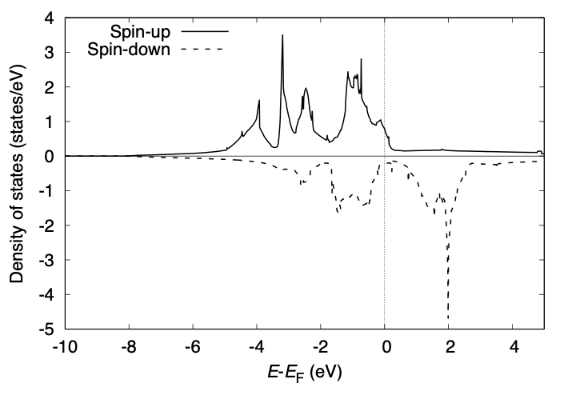
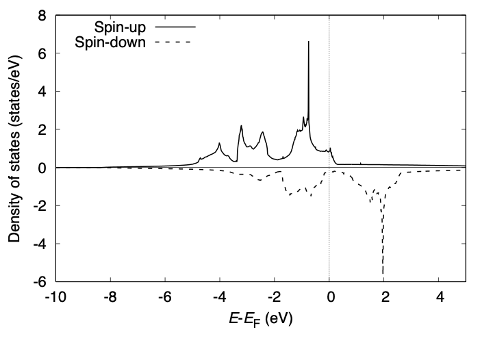
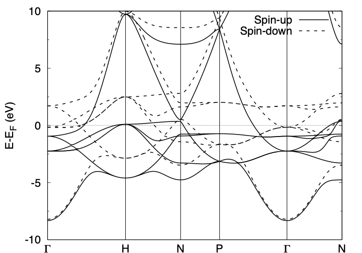

.. _tutorial_ni:

:orphan:

================
Crystalline iron  
================
This example explains how to perform the density of states and band structure analyses by using crystalline iron (Fe) as an example.

SCF calculation
===============
We begin with an SCF calculation. Input file looks like::

 WF_OPT      DAV
 NTYP        1
 NATM        1
 BRAVIS_TYPE 1
 NSPG        229
 GMAX         5.00
 GMAXP       15.00
 KPOINT_MESH 08 08 08
 MIX_ALPHA   0.50
 BZINT       TETRA
 EDELTA      1.0D-10
 NSPIN       2
 NEG         16
 XCTYPE      ggapbe
 CELL  5.40461887  5.40461887  5.40461887  90.00000000  90.00000000  90.00000000
 &ATOMIC_SPECIES
  Fe  55.845000 pot.Fe_pbe3
 &END
 &INITIAL_ZETA
   0.2000
 &END
 &ATOMIC_COORDINATES CRYSTAL
       0.0000      0.0000      0.0000    1    1    1
 &END
 
We use the tetrahedron method for the Brillouin zone integration.

The total density of states printed to ``dos.data`` can be visualized as:

NonSCF calculation
==================
We can improve the quality of DOS by increasing the k-point mesh for the Brillouin zone integration without a new SCF calculation.
We use the keyword ``TASK NSCF`` and perform a non-SCF calculation at a fixed charge density. Input file may look like::

 TASK        NSCF
 WF_OPT      DAV
 NTYP        1
 NATM        1
 BRAVIS_TYPE 1
 NSPG        229
 GMAX         5.00
 GMAXP       15.00
 KPOINT_MESH 16 16 16
 MIX_ALPHA   0.50
 BZINT       TETRA
 EDELTA      1.0D-10
 NSPIN       2
 NEG         16
 XCTYPE      ggapbe
 CELL  5.40461887  5.40461887  5.40461887  90.00000000  90.00000000  90.00000000
 &ATOMIC_SPECIES
  Fe  55.845000 pot.Fe_pbe3
 &END
 &INITIAL_ZETA
   0.2000
 &END
 &ATOMIC_COORDINATES CRYSTAL
       0.0000      0.0000      0.0000    1    1    1
 &END
 
The total density of states may be visualized as:

Band structure calculation
==========================
As in the :ref:`Ag<tutorial_ag>` case, set::

 TASK BAND

after the SCF calculation is converged and run the calculation.
The input file for the band structure may look like::

 TASK        BAND
 WF_OPT      DAV
 NTYP        1
 NATM        1
 BRAVIS_TYPE 1
 NSPG        229
 GMAX         5.00
 GMAXP       15.00
 KPOINT_MESH 08 08 08
 MIX_ALPHA   0.50
 BZINT       TETRA
 EDELTA      1.0D-10
 NSPIN       2
 NEG         16
 XCTYPE      ggapbe
 CELL  5.40461887  5.40461887  5.40461887  90.00000000  90.00000000  90.00000000
 &ATOMIC_SPECIES
  Fe  55.845000 pot.Fe_pbe3
 &END
 &INITIAL_ZETA
   0.2000
 &END
 &ATOMIC_COORDINATES CRYSTAL
       0.0000      0.0000      0.0000    1    1    1
 &END
 &KPOINTS_BAND
  NKSEG 5
  KMESH 30 30 20 30 30
  KPOINTS
   0.00  0.00  0.00
  -0.50  0.50  0.50
   0.00  0.00  0.50
   0.25  0.25  0.25
   0.00  0.00  0.00
   0.00  0.00  0.50
 &END

At the convergence, we obtain ``energy.data`` in addition to the standard output files.
To convert the ``energy.data`` file into a plottable one, use ``energy2band`` program.
For the spin polarized system (``NSPIN=2``), use

.. code:: bash

 $ energy2band -s

Enter the number of bands, number of k-points (for the band structure calculation), and the energy origin (we use the Fermi level obtained in the SCF calculation or the valence band maximum), we obtain the ``band.data`` file.
The band can be visualized by using gnuplot as:

