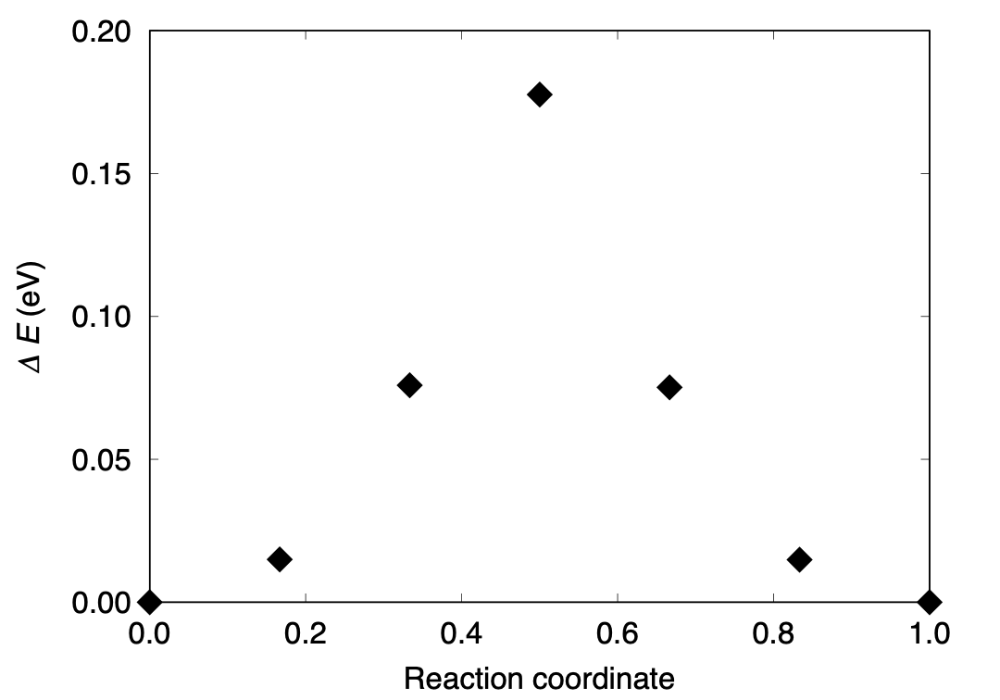

.. _tutorial_h2+h:

:orphan:

H\ :sub:`2`\+H
===============

This example shows how to run the nudged elastic band (NEB) calculation for a reaction path search.

To perform a NEB calculation, we need the following steps:

- Optimization of the initial state

- Optimization of the final state

- Preparation of the (initial) intermediate images and corresponding input files

- NEB calculation (constrained optimization along the reaction pathway)

In the following, we consider the following reaction

.. math:: \mathrm{H}_2 + \mathrm{H} \rightarrow \mathrm{H} + \mathrm{H}_2

Optimization of the initial and final state
-------------------------------------------

To save time for this example, input files created using the optmized geometries for the initial ``Initial/nfinp_ini`` and final ``Initial/nfinp_fin`` will be prepared as follows:

Initial/nfinp_ini::

  #
  # H2 + H
  #
  WF_OPT   DAV
  NTYP     1
  NATM     3
  TYPE     0
  NSPG     1
  GMAX    6.00
  GMAXP  20.00
  WAY_MIX  3
  MIX_ALPHA  0.2
  EDELTA  1.D-10
  NSPIN 2
  NEG     4
  CELL   15.00000000  15.00000000  15.00000000  90.00000000  90.00000000  90.00000000
  CPUMAX 1500.0
  &ATOMIC_SPECIES
   H   2.000000  pot.H_pbe1_sp_new
  &END
  &INITIAL_ZETA
    0.5000
  &END
  &ATOMIC_COORDINATES CARTESIAN
        0.0000000000        0.000000000000      0.000000000000    1    1    1
        1.4237027235        0.000000000000      0.000000000000    1    1    1
        5.6566329776        0.000000000000      0.000000000000    1    1    1
  &END

Final/nfinp_fin::

  #
  # H2 + H
  #
  WF_OPT   DAV
  NTYP     1
  NATM     3
  TYPE     0
  NSPG     1
  GMAX    6.00
  GMAXP  20.00
  WAY_MIX  3
  MIX_ALPHA  0.5
  EDELTA  1.D-10
  NSPIN 2
  NEG     4
  CELL   15.00000000  15.00000000  15.00000000  90.00000000  90.00000000  90.00000000
  &ATOMIC_SPECIES
   H   2.000000  pot.H_pbe1_sp_new
  &END
  &INITIAL_ZETA
    0.5000
  &END
  &ATOMIC_COORDINATES CARTESIAN
        0.0000000000        0.000000000000      0.000000000000    1    1    1
        4.23293025414       0.000000000000      0.000000000000    1    1    1
        5.6566329776        0.000000000000      0.000000000000    1    1    1
  &END

Run single-point (SCF) calculations in ``Initial`` and ``Final`` directories and confirm that the forces acting on the atoms are small enough and these state can be metastable states.

Preparation of the intermediate images
--------------------------------------

To perform the NEB calculation, we need to prepare the intermediate images along the reaction path considered.

Supposing that we have :math:`p-1` images between the initial (:math:`r_i^\alpha`) and final (:math:`r_i^\beta`), :math:`\kappa` th intermediate image can be obtained by a linear interpolation as

.. math:: r^\kappa_i = r_i^{\alpha} + \kappa ( r_i^{\beta} - r_i^{\alpha} ) / p 

In the current implementation, each image is optimized using an input file (``nfinp.data``) and geometry file (``nudged_2``) in a subdirectory. In addition, initial (final) state geometries should be given in ``nudged_terminal_s`` (``nudged_terminal_e``) in the subdirectory next to the initial (final) image. Furthermore, we use image (replica) parallel NEB, i.e., the parallelization is done over the images, and the number of cores should be divisable by the number of images.

Preparation can be done using a utility ``prepneb``. Create and go to a subdirectory ``NEB`` and execute

.. code:: bash

  $ prepneb -ndiv 6 -ini ../Initial/nfinp_ini  -fin ../Final/nfinp_fin

(type ``prepneb -h`` for more options)

This creates 7 images (subdirectories ``01``, ``02``, ... ``07``) including initial and final geometries as::

  01:
  nfinp.data  nudged_2
  02:
  nfinp.data  nudged_2  nudged_terminal_s
  03:
  nfinp.data  nudged_2
  04:
  nfinp.data  nudged_2
  05:
  nfinp.data  nudged_2
  06:
  nfinp.data  nudged_2  nudged_terminal_e
  07:
  nfinp.data  nudged_2

In each ``nfinp.data``, we need to use declare::

  GEO_OPT NEB

for standard NEB, and for the climing-image NEB (CINEB)::

  GEO_OPT CINEB

Also, the ``nudged_2`` contains the spring constant and the geometry of the intermediate image as::

        0.02000000
      1      0.000000000000      0.000000000000      0.000000000000
      2      2.828316488820      0.000000000000      0.000000000000
      3      5.656632977600      0.000000000000      0.000000000000

Here, the first line specify the spring constant, and the remaining lines specify the atomic index (1st column) and positions (2-4th columns) in the cartesian coordinate (in Bohr).

Furthermore, ``replica.cmd`` is required to run the image-parallel NEB. For this example it looks::

  ASYNC
  02
  03
  04
  05
  06

The first line specify if the images are syncronized or not, and should ``ASYNC`` or ``NEB`` for the NEB calculation. The following lines specify the directories containing the intermediate images (excluding the initial and final images).

.. warning::
  If ``replica.cmd`` exists, normal STATE jobs cannot be executed. Make sure that there is ``replica.cmd`` *only* when replica-NEB is executed.

Running the NEB calculation
---------------------------

Finally, the NEB calculation can be executed, in the presence of ``replica.cmd`` as

.. code ::bash
  
  $ mpirun -np 6 STATE > neb.log

The standard output is not mandatroy, and actual output is written to ``nfout.data`` in each directory.

In contrast to the usual structural optmization, the calculation is not terminated automatically.
Instead, we mononitor the convergence of the force along and perpendicular to the reaction coordinate, and when the force perpendicular to the reaction coordinate is small, we judge the NEB calculation is converged. To do so, we grep the keyword ``ForceIn`` (``ForceOut``) in the output file for the force perpendicular (parallel) to the reaction coordinate. For example

.. code ::bash

  $ for d in 0[2-6]; do grep -A1 ForceIn $d/nfout.data | tail -2; done

and we obtain::

  NEB:     Dist1     Dist3  AbsForce   ForceIn  ForceOut    CosPhi    Switch
  NEB:   0.71047   0.73707   0.00064   0.00031  -0.00153   0.79410   0.10101

  NEB:     Dist1     Dist3  AbsForce   ForceIn  ForceOut    CosPhi    Switch
  NEB:   0.73677   0.77057   0.00074   0.00023  -0.00453   0.83762   0.06366

  NEB:     Dist1     Dist3  AbsForce   ForceIn  ForceOut    CosPhi    Switch
  NEB:   0.77053   0.77023   0.00011   0.00011   0.00021   0.24898   0.85468

  NEB:     Dist1     Dist3  AbsForce   ForceIn  ForceOut    CosPhi    Switch
  NEB:   0.77068   0.73493   0.00078   0.00023   0.00451   0.83650   0.06452

  NEB:     Dist1     Dist3  AbsForce   ForceIn  ForceOut    CosPhi    Switch
  NEB:   0.73547   0.70698   0.00070   0.00036   0.00152   0.79843   0.09695

and we can confirm the the forces perpendicular to the reaction coordinate (``ForceIn``) are small.

Finally, by plotting the final energy (difference),  we obtain the following energy profile.

