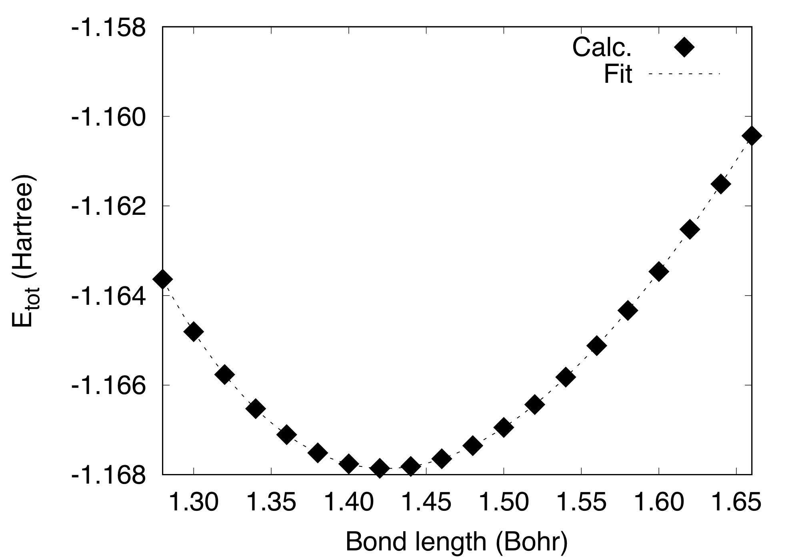

Hydrogen molecule
=================

This tutorial explains how to perform the convergence study with respect to the plane-wave cutoff and unit cell size and how to perform the geometry optimization of molecular system.
With the periodic boundary condition, an isolated molecule is simulated by putting a molecule in a box, which is large enough to avoid the interaction between periodic images.
Here, we use a hydrogen molecule with the generalized gradient approximation (GGA) and the electron-ion interaction is described by using the Troullier-Martins normconserving pseudopotential (pot.H_pbe1TM).
Note that the potentials is rather new and still in the experimental stage.

Convergence with respect to the plane-wave cutoff
-------------------------------------------------
In a calculation with a plane-wave basis set, kinetic energy cutoff for the plane-wave basis to expand the wave functions is one of the most important parameters to control the accuracy of the calculation.
In the STATE code, cutoff wave vectors in the atomic unit for the wave functions (GMAX) GMAX**2 and are the cutoff energies in Ry (:math:`E_{\rm{cut}}^{\rm{wf}} = {\rm{GMAX}}^2`)

Typical input file for a hydrogen molecule placed in a cubic box with the cell edges of 10 Bohr with the cutoff wave vector of 8.5 looks like::

  WF_OPT    DAV
  NTYP      1
  NATM      2
  TYPE      0
  GMAX      8.5
  NSCF      200
  NSTEP     200
  MIX_ALPHA 0.7
  WIDTH     0.0010
  EDELTA    0.1000D-09
  NEG       2
  &CELL
       10.000000000000     0.000000000000     0.000000000000
        0.000000000000    10.000000000000     0.000000000000
        0.000000000000     0.000000000000    10.000000000000
  &END
  &ATOMIC_SPECIES
   H    1.00794  pot.H_pbe1TM
  &END
  &ATOMIC_COORDINATES CARTESIAN
       -0.699200000000      0.000000000000      0.000000000000    1    1    1
        0.699200000000      0.000000000000      0.000000000000    1    1    1
  &END

In this example, just single-point or self-consistent-field (SCF) calculations are performed.

By calculating the total energy as a function of cutoff wave vector (or cutoff energy), we obtain the following::

  #GMAX  Etot(Ha)
   4.0   -1.12631192
   4.5   -1.13872853
   5.0   -1.14741886
   5.5   -1.15466363
   6.0   -1.16001126
   6.5   -1.16308059
   7.0   -1.16504592
   7.5   -1.16639699
   8.0   -1.16725114
   8.5   -1.16774636
   9.0   -1.16801634
   9.5   -1.16816071
   10.0  -1.16822656
   10.5  -1.16824541
   11.0  -1.16824728
   11.5  -1.16824859
   12.0  -1.16825488
   12.5  -1.16826709
   13.0  -1.16828309
   13.5  -1.16830009
   14.0  -1.16831441
   14.5  -1.16832631
   15.0  -1.16833470
   15.5  -1.16833925
   16.0  -1.16834156

This can be visualized by using for e.g., gnuplot or xmgrace.

Convergence with respect to the plane-wave cutoff
-------------------------------------------------
In addition to the cutoff energy, the convergence with respect to the unit cell size should be achieved to simulate an isolated molecule. Using GMAX=8.5, total energy as a function of cell edge is obtained as follows::

 #Cell_edge (Bohr) Etot (Ha)
   5.0             -1.32945167
  10.0             -1.16774636
  15.0             -1.16600767
  20.0             -1.16598742

Geometry optimization (manual optimization)
-------------------------------------------
Geometry of a diatomic molecule can be optimized by calculating the total energy by varying bond length.
In this set of calculations, GMAX of 8.5 and the unit cell edges of 10.0 Bohr are used.
The total energy of the hydrogen molecule as a function of bond length is calculated as::

  #d (Bohr)      Etot (Hartree)
  1.280000000000 -1.16363627
  1.300000000000 -1.16480618
  1.320000000000 -1.16576530
  1.340000000000 -1.16652763
  1.360000000000 -1.16710626
  1.380000000000 -1.16751340
  1.400000000000 -1.16776049
  1.420000000000 -1.16785820
  1.440000000000 -1.16781652
  1.460000000000 -1.16764477
  1.480000000000 -1.16735167
  1.500000000000 -1.16694535
  1.520000000000 -1.16643342
  1.540000000000 -1.16582298
  1.560000000000 -1.16512066
  1.580000000000 -1.16433266
  1.600000000000 -1.16346478
  1.620000000000 -1.16252244
  1.640000000000 -1.16151070
  1.660000000000 -1.16043432

and visualized as:

By fitting the total energy to a six-th order polynomial, the equilibrium bond length of 1.424 Bohr (0.753 Angstrom) was obtained.

Geometry optimization
---------------------
In a complex system, manual optimization is difficult to perform.
In such a case, Hellmann-Feynman forces are used to perform the geometry optimization.
To do so, we use the keyword ``GEO_OPT`` and set the force criterion ``FMAX`` to 1.e-3 to 1.e-4 Hartree/Bohr.
In example, generalized direct inversion of iterative subspace (GDIIS) method is used (``GEO_OPT GDIIS``) with the time step (``DTIO``) of 50 atomic unit::

  WF_OPT    DAV
  GEO_OPT   GDIIS
  FMAX      0.5D-03
  DTIO      50.00
  NTYP      1
  NATM      2
  GMAX      8.5
  NSCF      200
  NSTEP     200
  MIX_ALPHA 0.7
  WIDTH     0.0010
  EDELTA    1D-10
  NEG       2
  XCTYPE    ggapbe
  &CELL
       10.000000000000      0.000000000000      0.000000000000
        0.000000000000     10.000000000000      0.000000000000
        0.000000000000      0.000000000000     10.000000000000
  &END
  &ATOMIC_SPECIES
   H    1.00794  pot.H_pbe1TM
  &END
  &ATOMIC_COORDINATES CARTESIAN
       -0.699200000000      0.000000000000      0.000000000000    1    1    1
        0.699200000000      0.000000000000      0.000000000000    1    1    1
  &END

After the structural optimzation, type:

.. code:: bash
  
  $ grep -A1 f_max nfout_1

and we get the following (supposing the name of output file is ``nfout_1``)::

     NIT     TotalEnergy     f_max     f_rms      edel      vdel      fdel
       1     -1.16774636  0.009134  0.009134  0.11D-10  0.95D-08  0.11D-10
  --
     NIT     TotalEnergy     f_max     f_rms      edel      vdel      fdel
       2     -1.16781428  0.005758  0.005758  0.97D-12  0.69D-08  0.97D-12
  --
     NIT     TotalEnergy     f_max     f_rms      edel      vdel      fdel
       3     -1.16786063  0.000242  0.000242  0.24D-11  0.93D-08  0.24D-11

We can see that after the 3 optimization steps, the maximum force (``f_max``) becomes 2.4e-4 and is smaller than the threshold of 5e-4, and the calcultations is normally terminated.

The optimized bond length is 1.423 Bohr (0.735 Angstrom), in good agreement with that obtained by the manual optimization.
The result is in good agreement with the all-electron result of 0.749 Angstrom [1]_ (deviation of -1.9%).

Note that the GDIIS algorithm is efficient near the equilibrium by construction, otherwise quenched molecular dynamics ``QMD`` (aka quick min) or fire (``FIRE``) algorithms are used.
In our practice, GDIIS works pretty well, when the maximum force (``f_max`` in the output) is smaller that, say, 1.e-2, but this is not the case for the weakly interacting system.

Atomization energy calculation
==============================

Finally, let us compute the atomization energy of the hydrogen molecule.
To do so, we need the energy of a spin-polarized hydrogen atom.
We use the following input to calculate it::

  WF_OPT DAV
  NTYP      1
  NATM      1
  GMAX      8.5
  NSCF      200
  NSTEP     200
  MIX_ALPHA 0.7
  WIDTH     0.0010
  EDELTA    0.1000D-09
  NEG       4
  NSPIN     2
  &INITIAL_ZETA
   0.20
  &END
  &CELL
       10.000000000000      0.000000000000      0.000000000000
        0.000000000000     10.000000000000      0.000000000000
        0.000000000000      0.000000000000     10.000000000000
  &END
  &ATOMIC_SPECIES
   H    1.00794  pot.H_pbe1TM
  &END
  &ATOMIC_COORDINATES CARTESIAN
        0.000000000000      0.000000000000      0.000000000000    1    1    1
  &END

Note we used ``NSPIN 2`` to allow spin polarization and ``&INITIAL_ZETA...&`` to set the initial magnetization.
The calculated total energy for the hydrogen atom is -0.50198747 Hartree, and we get the binding energy of -4.460 eV (-430.282 kJ/mol or -102.84 kcal/mol).
Compare with the all-electron result of 104.8 kcal/mol [1]_.

.. [1] F. Tran, R. Laskowski, P. Blaha, and K. Schwarz, Phys. Rev. B **75**, 115131 (2007).

