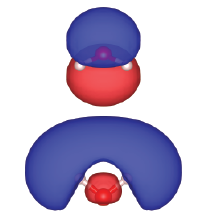

.. _tutorial_co:

:orphan:

Water
=====
In this example, how to draw orbital/wave function densities, i.e., square moduli of the wave functions by using a water molecule as an example

SCF calculation
-----------------------

First we obtain the self-consistent electron density and wave functions of water molecule by using the following input file::

  WF_OPT     DAV
  NTYP       2
  NATM       3
  GMAX        6.00
  GMAXP      20.00
  MIX_ALPHA   0.5
  EDELTA      1.D-10
  NEG        12
  CELL       15.00 15.00 15.00  90.00  90.00  90.00
  &ATOMIC_SPECIES
   H   12.000000 pot.H_lda1
   O   12.000000 pot.O_pbe1
  &END
  &ATOMIC_COORDINATES CARTESIAN
        1.453447222619      0.000000000000      1.124989276510    1    1    1
       -1.453447222619      0.000000000000      1.124989276510    1    1    1
        0.000000000000      0.000000000000      0.000000000000    1    1    2
  &END

Wave function density plot
--------------------------
We then modify the input file ``nfinp_mo`` as::

  TASK       PRTWFC
  WF_OPT     DAV
  NTYP       2
  NATM       3
  GMAX        6.00
  GMAXP      20.00
  MIX_ALPHA   0.5
  EDELTA      1.D-10
  NEG        12
  CELL       15.00 15.00 15.00  90.00  90.00  90.00
  &ATOMIC_SPECIES
   H   12.000000 pot.H_lda1
   O   12.000000 pot.O_pbe1
  &END
  &ATOMIC_COORDINATES CARTESIAN
        1.453447222619      0.000000000000      1.124989276510    1    1    1
       -1.453447222619      0.000000000000      1.124989276510    1    1    1
        0.000000000000      0.000000000000      0.000000000000    1    1    2
  &END
  &PLOT
   IKPT 1
   IBS  4
   IBE  5
   CHG_WFN
   ADD_SIGN
   FORMAT XSF
  &END

Similar to the wave function plot, we use the option::

  TASK      PRTWFC

and the following block is used to plot the wave function in real space::

  &PLOT
   IKPT 1
   IBS  4
   IBE  5
   CHG_WFN
   ADD_SIGN
   FORMAT XSF
  &END

In this case, we are going to plot 4th (HOMO) and 5th wave function densities.
by using the keyword ``CHG_WFN``, the wave function density is calculated.
Furthermore, by using ``ADD_SIGN`` the sign of the wave function is added to the wave function density.
Note that the sign is meaningful only at the Gamma-point.

By executing STATE by using the above input file, you may obtain the following wave functions::

  nfwfn_kpt0001_band0004.xsf  
  nfwfn_kpt0001_band0005.xsf  

The naming convention is::

  nfwfn_kpt[kpoint_index]_band[band_index].xsf

By using `VESTA <https://jp-minerals.org/vesta/jp/>`_ the wave function densities for HOMO and LUMO can be visualized as:

