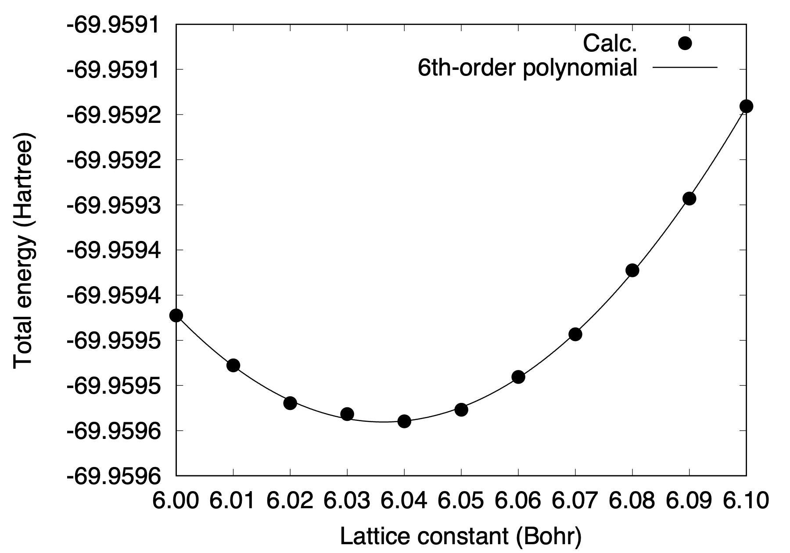

.. _tutorial_ni:

:orphan:

==============================
Monolayer molybdenum disulfied
==============================

This tutorial explains how to optimize the cell parameter of a system with internal degree(s) of freedom, by taking monolayer molybdenum disulfied (MoS\ :sub:`2`\) as an example.

An example input file for monolayer MoS\ :sub:`2`\ is as follows::

  #
  # Monolayer MoS2
  #
  TASK      GEO_OPT
  WF_OPT    DAV
  NTYP      2
  NATM      3
  TYPE      0
  GMAX      6.0
  GMAXP     20.0
  MIX_ALPHA 0.3
  SMEARING  MP
  WIDTH     0.0010
  NEG       28
  GEO_OPT   QMD
  DTIO      200.0
  KPOINT_MESH    12 12  1
  KPOINT_SHIFT    F  F  F
  CELL  6.04 6.04 18.8972612463  90.00000000  90.00000000 120.00000000
  &ATOMIC_SPECIES
   Mo  95.95 pot.Mo_pbe1
   S   32.06 pot.S_pbe1
  &END
  &ATOMIC_COORDINATES CRYSTAL
        0.333333333333      0.666666666667      0.000000000000    1    1    1
        0.666666666667      0.333333333333      0.160000000000    1    1    2
        0.666666666667      0.333333333333     -0.160000000000    1    1    2
  &END

.. note::
  It is not necessary to use the MP smearing as MoS\ :sub:`2`\. Use ``WIDTH`` without ``SMEARING``, if there is not convergence issue (this can be the case when the band gap is very small)

For each lattice constant, we optimize the internal degree of freedom using the quenched molecular dynamics (``GEO_OPT QMD``).
We repeat the structural optimization for a given set of lattice constants (from 6.0 Bohr to 6.1 Bohr with a step width of 0.01 Bohr), and obtain the total energy as a function of the lattice constant as follows:

By fitting the total energy to the 6-th order polynomial, we obtain the equilibrium lattice constant of 6.036 Bohr (3.194 Angstrom), which is comparable to that reported in a literature (see for example, 3.19 Angstrom with PBE, Phys. Rev. B 89, 121103 (2014)).

