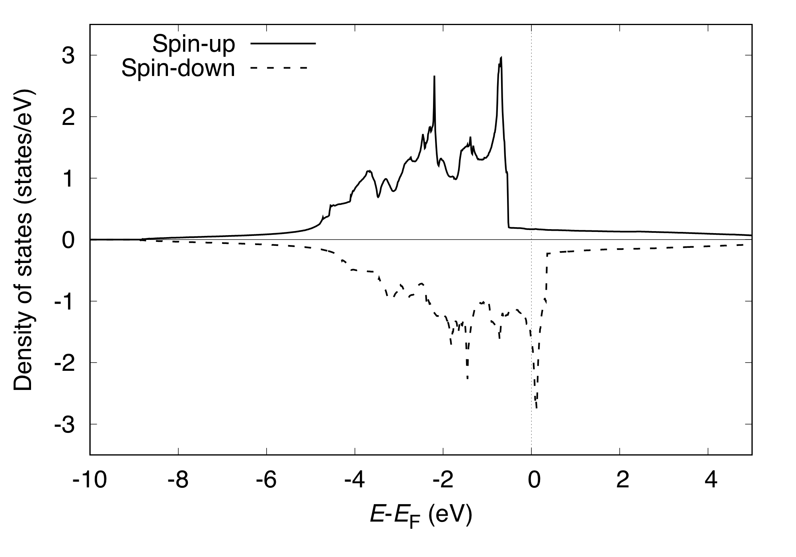

.. _tutorial_ni:

==================
Crystalline nickel
==================
This example explains how to perform the density of states and band structure analyses by using crystalline nickel (Ni) as an example.

SCF calculation
===============
We begin with an SCF calculation.
We also perform the PDOS calculation at the convergence.
Input file looks like::

 TASK          SCF
 WF_OPT        DAV
 NTYP          1
 NATM          1
 TYPE          2
 NSPG          225
 GMAX           5.00
 GMAXP         15.00
 KPOINT_MESH   24 24 24
 KPOINT_SHIFT  F     F     F
 MIX_ALPHA     0.3
 BZINT         TETRA
 EDELTA        0.5000D-09
 NSPIN         2
 NEG           24
 CELL          6.70 6.70 6.70  90.00  90.00  90.00
 &INITIAL_ZETA
  0.200
 &END
 &ATOMIC_SPECIES
  Ni  58.690000 pot.Ni_pbe4
 &END
 &ATOMIC_COORDINATES CRYSTAL
   0.00  0.00  0.00    1    0    1
 &END
 &PDOS
  NPDOSAO 1
  IPDOST  1
  EMIN    -15.00
  EMAX      5.00
  EWIDTH    0.10
  NPDOSE   501
  RCUT    2.40
  RWIDTH  0.20
 &END
 
We use the tetrahedron method for the Brillouin zone integration.

The total density of states printed to ``dos.data`` can be visualized as:

Band structure calculation
==========================
As in the :ref:`Ag<tutorial_ag>` case, set::

 TASK BAND

after the SCF calculation is converged and run the calculation.
The input file for the band structure may look like::

 TASK          BAND
 WF_OPT        DAV
 NTYP          1
 NATM          1
 TYPE          2
 NSPG          225
 GMAX           5.00
 GMAXP         15.00
 MIX_ALPHA     0.3
 BZINT         TETRA
 EDELTA        0.5000D-09
 NSPIN         2
 NEG           24
 CELL          6.70 6.70 6.70  90.00  90.00  90.00
 &INITIAL_ZETA
  0.200
 &END
 &ATOMIC_SPECIES
  Ni  58.690000 pot.Ni_pbe4
 &END
 &ATOMIC_COORDINATES CRYSTAL
   0.00  0.00  0.00    1    0    1
 &END
 &KPOINTS_BAND
  NKSEG 4
  KMESH 40 20 20 20
  KPOINTS
  0.000 0.000 0.000
  0.000 0.500 0.500
  0.250 0.500 0.750
  0.500 0.500 0.500
  0.000 0.000 0.000
 &END

At the convergence, we obtain ``energy.data`` in addition to the standard output files.
To convert the ``energy.data`` file into a plottable one, use ``energy2band`` program.
For the spin polarized system (``NSPIN=2``), use

.. code:: bash

 $ energy2band -s

Enter the number of bands, number of k-points (for the band structure calculation), and the energy origin (we use the Fermi level obtained in the SCF calculation or the valence band maximum), we obtain the ``band.data`` file.
The band can be visualized by using gnuplot as:

