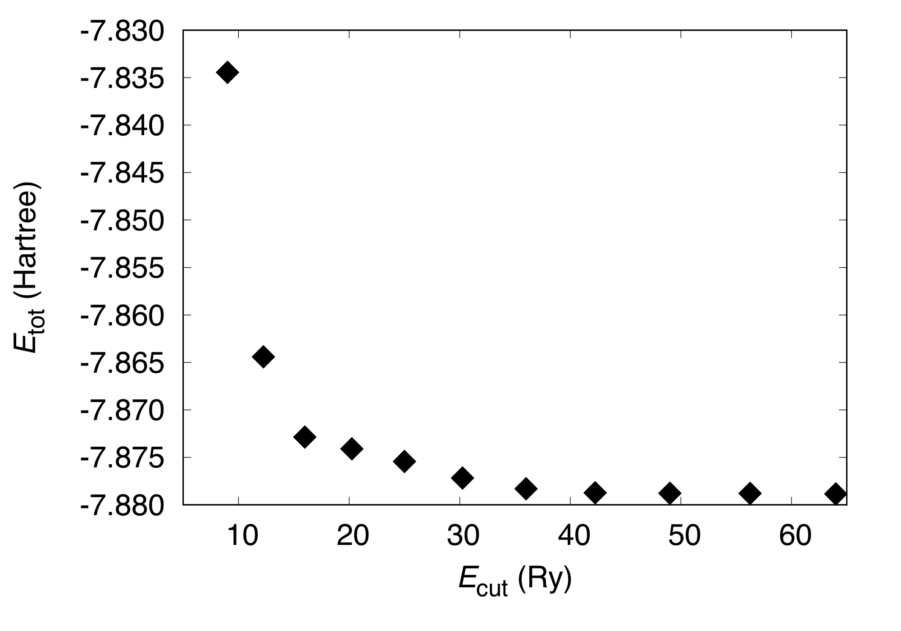
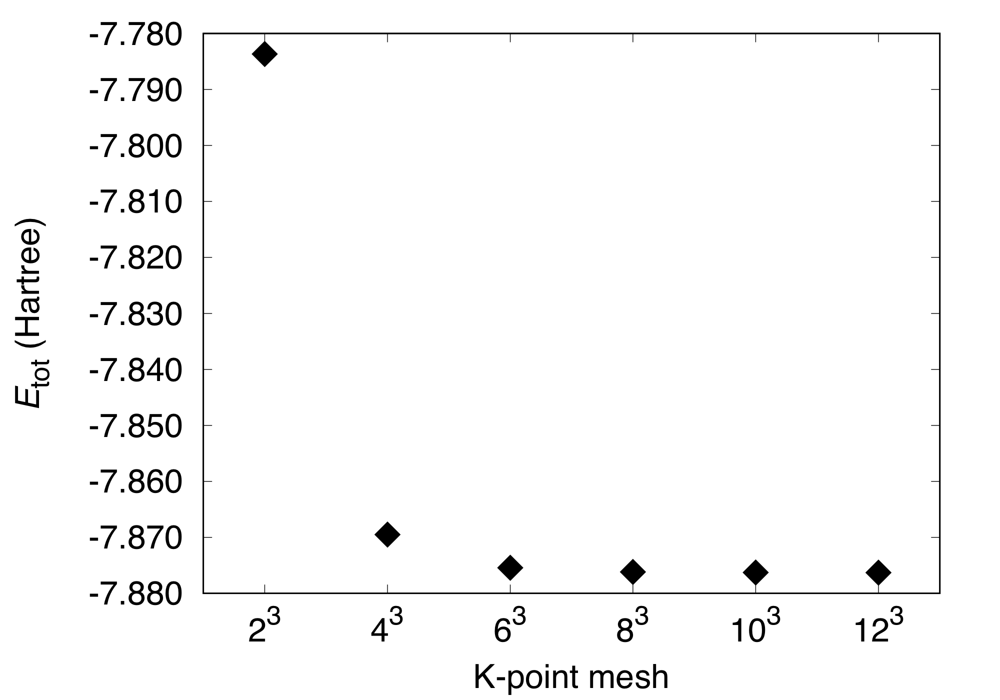
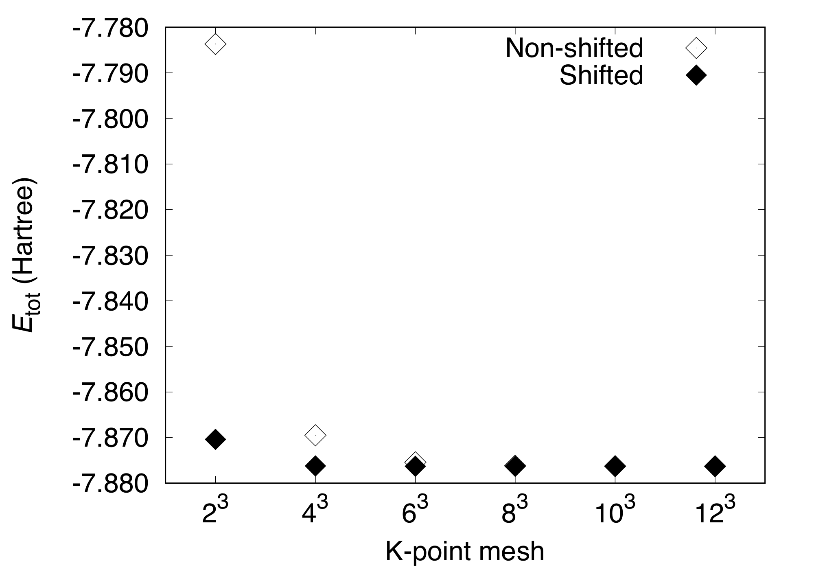
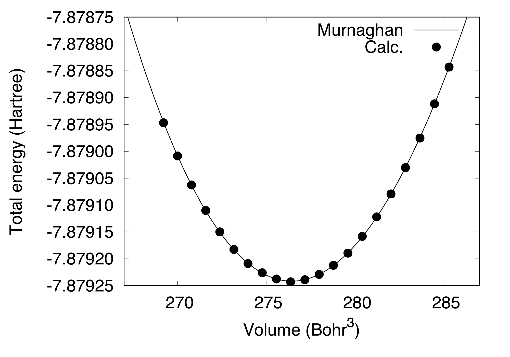
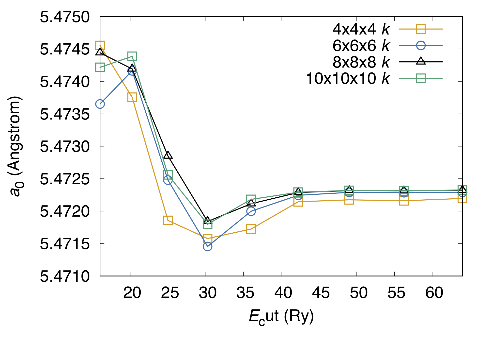

Crystalline Silicon
===================
This tutorial explains how to perform convergence study with respect to the cutoff energy and the number of k-points, and how to obtain the equilibrium cell parameters of crystalline materials by taking the crystalline silicon in the diamond structure.

Convergence with respect to the cutoff energy
---------------------------------------------
Let us investigate the convergence of the total energy with respect to the cutoff energy.
Here, the lattice constant of 10.30 Bohr and 6 x 6 x 6 (non-shifted) k-point mesh are used.
Normconserving pseudopotential (pot.Si_pbe1) is used.

Basic input file looks::

  WF_OPT    DAV
  NTYP      1
  NATM      2
  TYPE      2
  NSPG      227
  GMAX      5.0
  KPOINT_MESH    6  6  6
  WIDTH     0.0002
  EDELTA    1.0000D-10
  NEG    8
  CELL   10.30  10.30  10.30  90.00  90.00  90.00
  &ATOMIC_SPECIES
   Si 28.0900 pot.Si_pbe1
  &END
  &ATOMIC_COORDINATES CRYSTAL
        0.000000000000      0.000000000000      0.000000000000    1    1    1
        0.250000000000      0.250000000000      0.250000000000    1    1    1
  &END

For crystalline materials, the k-point mesh is set by using::

  KPOINT_MESH    6  6  6

Further, the space group can be specified by using::

  NSPG      227

In this case, the cell parameters are specified by::

  CELL   10.30  10.30  10.30  90.00  90.00  90.00

In addition, the atomic positions can be specified by using the crystal coordinate::

  &ATOMIC_COORDINATES CRYSTAL
        0.000000000000      0.000000000000      0.000000000000    1    1    1
        0.250000000000      0.250000000000      0.250000000000    1    1    1
  &END

By varying the cutoff energy, we get the following::

  #Cutoff(Ry)  Etot(Hartree)
   9.000       -7.83444507
  12.250       -7.86441525
  16.000       -7.87286277
  20.250       -7.87410168
  25.000       -7.87543633
  30.250       -7.87718103
  36.000       -7.87830865
  42.250       -7.87873523
  49.000       -7.87879124
  56.250       -7.87880562
  64.000       -7.87885742

This can be visualized as:

Convergence with respect to the k-points
----------------------------------------
In crystalline materials, Brillouin zone (k-point) sampling is important to obtain accurate materials properties.
The k-point sampling is critical especially for the metallic systems, which have the Fermi surface.

We calculate the total energy by varying the k-point mesh. We use the cutoff wave vector (``GMAX``) of 5.0.::

  #K-point mesh Etot(Hartree)
   2  2  2      -7.78367031
   4  4  4      -7.86949823
   6  6  6      -7.87543633
   8  8  8      -7.87617404
  10 10 10      -7.87627660
  12 12 12      -7.87629987

This can be visualized as:

In the above calculations, the k-point shift is switched off and the k-points are Gamma-centered.
For more efficient calculation, the (shifted) Monkhorst-Pack [1]_ k-point points can be used.
In this case, we use the keyword ``KPOINT_SHIFT`` as::

  KPOINT_SHIFT   T     T     T

and the total energy varies as::

  #K-point mesh Etot(Hartree)
   2  2  2      -7.87039589
   4  4  4      -7.87622137
   6  6  6      -7.87630204
   8  8  8      -7.87630746
  10 10 10      -7.87630612
  12 12 12      -7.87630578

We can see that the convergence of total energy is much faster when the k-point shift is activated.

Cell optimizatin
----------------

In the current version of STATE, the stress tensor is not yet implemented (there was an implementation in the ancestor of STATE) and thus, the cell parameters should be optimized manually.
The equilibrium lattice parameter is obtained by calculating the total energy as a function of cell parameter and by fitting to a certain function.
In this example, we use the cutoff wave vector (cutoff energy) of 6 (36 Ry), 8x8x8 Monkhorst-Pack k-point mesh, to obtain::

  #Volume(Bohr^3) Etot(Ha)
  0.269223E+03    -7.87894684
  0.270011E+03    -7.87900861
  0.270802E+03    -7.87906256
  0.271593E+03    -7.87911006
  0.272387E+03    -7.87915009
  0.273182E+03    -7.87918272
  0.273978E+03    -7.87920895
  0.274776E+03    -7.87922612
  0.275576E+03    -7.87923778
  0.276377E+03    -7.87924300
  0.277179E+03    -7.87923899
  0.277984E+03    -7.87922903
  0.278789E+03    -7.87921234
  0.279597E+03    -7.87918964
  0.280406E+03    -7.87915837
  0.281216E+03    -7.87912204
  0.282028E+03    -7.87907946
  0.282842E+03    -7.87903035
  0.283657E+03    -7.87897533
  0.284473E+03    -7.87891173
  0.285292E+03    -7.87884315

By fitting to the Murnaghan equation of state (here we use the ``eosfit`` script in the ``utility`` directory):

We obtain the equilibrium lattice parameter of 5.472 Angstrom.

Convergence of the equilibrium lattice parameter can also be studied:

We can see that with the current setting, the lattice parameter is well converged, with the error smaller than 1.e-3 Angstrom.

.. warning::
   The shifted k-point grid should not be used for *hexagonal* systems, because it breaks the symmetry.

.. [1] H. J. Monkhorst and J. D. Pack, Phys. Rev. B **13**, 5188 (1976).
