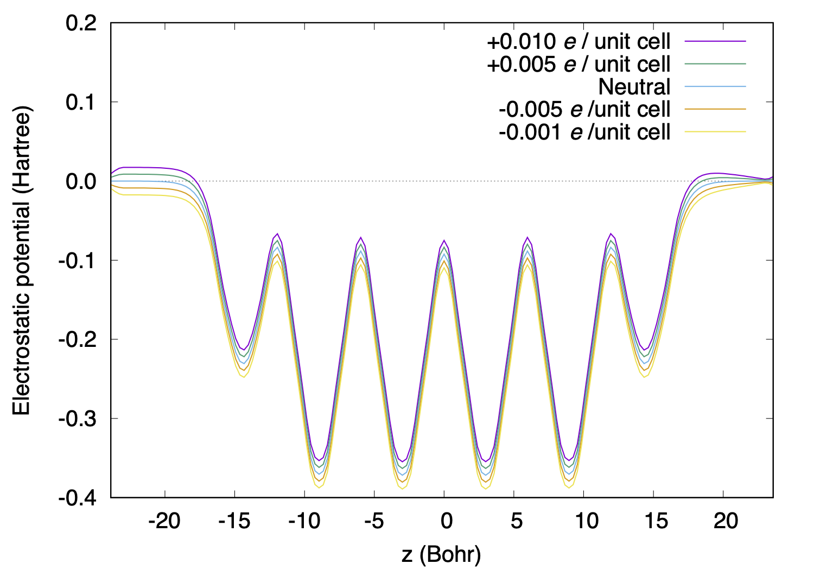
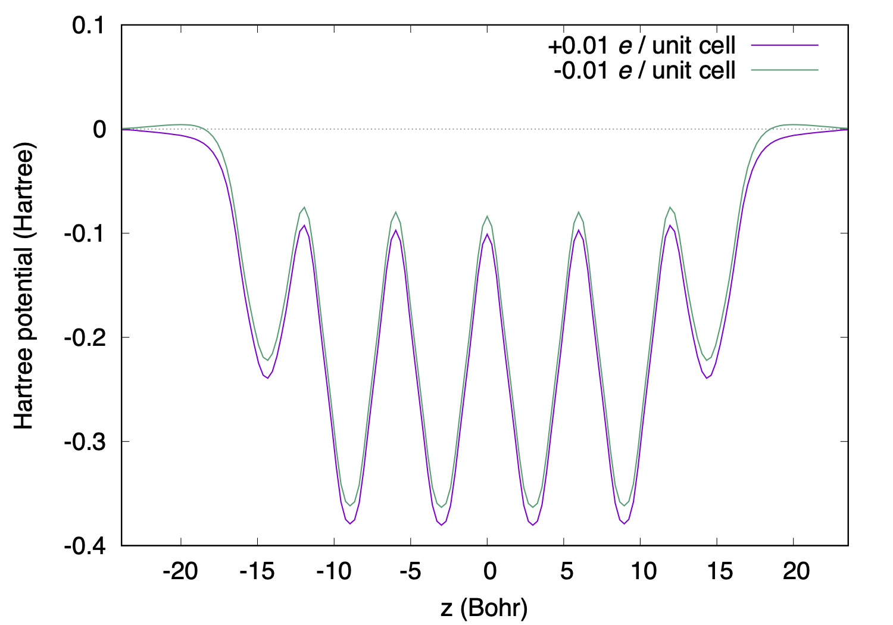
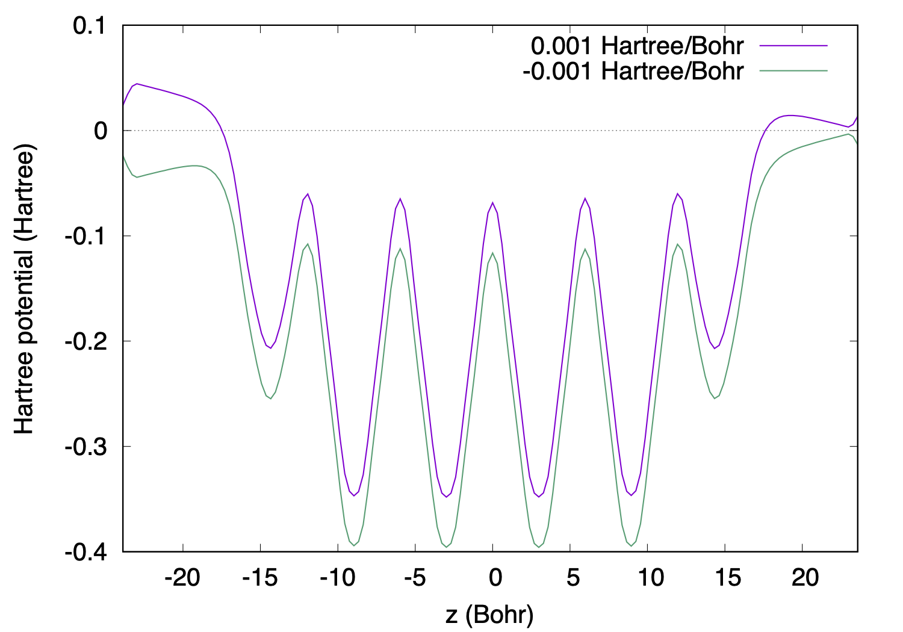

.. _tutorial_si111-al:

:orphan:

Electrified surface with the ESM method
=======================================

This tutorial explains how to simulate an electrified surface/interface by using the effective screening medium (ESM) method of Otani and Sugino [Phys. Rev. B **73**, 115407 (2006)].
We use an Al atom adsorbed Si(111) surface [Si(111)(1x1)-Al] to mimic the example shown in the original ESM paper.

Here is an input file for negatively charged Si(111)(1x1)-Al::

  #
  # Al terminated Si(111)(1x1) surface
  #
  WF_OPT  DAV
  NTYP     2
  NATM     10
  TYPE     0
  GMAX    5.00
  GMAXP  10.00
  KPOINT_MESH    6  6  1
  KPOINT_SHIFT   F  F  F
  MIX_ALPHA  0.50
  SMEARING MP
  WIDTH   0.0010
  EDELTA  0.1000D-09
  NEG   32
  &ESM
   BOUNDARY_CONDITION BC3
   CHARGE            -0.010
  &END
  &CELL
        7.312042349988      0.000000000000      0.000000000000
       -3.656021174994      6.332414428638      0.000000000000
        0.000000000000      0.000000000000     47.762060626914
  &END
  &ATOMIC_SPECIES
   Si  28.0855 pot.Si_pbe1
   Al  26.9620 pot.Al_pbe1
  &END
  &ATOMIC_COORDINATES CARTESIAN
        0.000000008137     -0.000000027706     14.446712499176    1    1    2
       -0.000000031986      4.221609614169    -14.446714858614    1    1    2
        0.000000000000      0.000000000000      9.701668564842    1    0    1
        0.000000000000      4.221609619092      8.209104170251    1    0    1
        0.000000000000      4.221609619092      3.731410986478    1    0    1
        0.000000000000     -4.221609619092      2.238846591887    1    0    1
        0.000000000000     -4.221609619092     -2.238846591887    1    0    1
        0.000000000000      0.000000000000     -3.731410986478    1    0    1
        0.000000000000      0.000000000000     -8.209104170251    1    0    1
        0.000000000000      4.221609619092     -9.701668564842    1    0    1
  &END

To use the ESM method, ``&ESM ... &END`` block should be inserted as::

  &ESM
   BOUNDARY_CONDITION BC3
   CHARGE            -0.010
  &END

Here, ``BOUNDARY_CONDITION`` specifies the boundary condition used. In the current implementatin, following options are available:

- ``BC1`` or ``BARE`` : vacuum/slab/vacuum boundary condition (open boundary condition)
- ``BC2`` or ``PE1``  : metal/slab/metal boundary condition (slab with both sides charged or with a uniform electric field)
- ``BC3`` or ``PE2``  : vacuum/slab/vacuum boundary condition (slab with one side charged)

``BC1`` is particularly useful for surface with adsorbate. Usually, the dipole correction is used to handle asymmetric slab or polar slab under the periodic boundary condition, but with this boundary condition, we are able to calculate a any slab rigorously. See Phys. Rev. B **80**, 165411 (2009) for more detail.
``BC2`` can be used to study a slab with both side of the surface is charged, or that under an electric field. Latter may be the case for insulators under an uniform electric field.
``BC3`` is often used to study an electrified interface: With this boundary condition, bottom surface is not charged and we can refer the vacuum level.

The charge of the system (per unit cell) can be specified with ``CHARGE``. Note that the negative value indicates the system is negatively charged (electron excess).

If the ESM option is activate, we can see the lines like::

   ESM METHOD OF OTANI AND SUGINO PRB73 115407 (2006).
   BOUNDARY CONDTION (III): PE2         
  
   *** ESM SETTING INFORMATION ***
   Z1            :   23.88103 A.U.
   CHARGE        :   -0.01000
   *******************************

where ``Z1`` is the z-position of the boundary between vacuum and ESM regions.
Default value for ``Z1`` is c/2, where c is the length of the lattice vector normal to the surface (3rd lattice vector).

.. note ::
	In the ESM calculation, the 3rd lattice vector should be in the z-direction.

.. note ::
	In the ESM calculation, the slab should be located between -Z1 (-c/2) and +Z1 (c/2) and the charge density should be negligibly small at -Z1/Z1.

By performing SCF calculations by varying the charge (from -0.01 to +0.01), we can obtain the electrostatic (Hartree) potentials as a function of charge as follows (see ``CHGPRO`` in the output file) :

Here, we can see the slope of the potentials in the right (vacuum) region, while those in the left region remain flat, because of the boundary condition we employ.

.. note ::
	In the BC2/BC3 boundary condition, the origin of the potential is set to ``Z1``.

In the following, we will see some results using the boundary condition ``BC2``.

To simulate a symmetrically charged slab, the folloiwng keyword are used::

  &ESM
   BOUNDARY_CONDITION BC2
   CHARGE             0.010
  &END

In the output file, we can see the following lines::

   ESM METHOD OF OTANI AND SUGINO PRB73 115407 (2006).
   BOUNDARY CONDTION (II) : PE1         
  
   *** ESM SETTING INFORMATION ***
   Z1            :   23.88103 A.U.
   CHARGE        :    0.01000
   *******************************

and the resulting electrostatic potentials for +0.01 and -0.01 electrons per unit cell look like:

In contrast to the ``BC3`` case, the potential is symmetric.

To simulate a slab under a uniform electric field, the folloiwng keyword are used::

  &ESM
   BOUNDARY_CONDITION BC2
   ELECTRIC_FIELD            0.001
  &END

and in the output, we can see the following message::

   ESM METHOD OF OTANI AND SUGINO PRB73 115407 (2006).
   BOUNDARY CONDTION (II) : PE1         
  
   *** ESM SETTING INFORMATION ***
   Z1            :   23.88103 A.U.
   CHARGE        :    0.00000
   E-FIELD       :    0.00100 HA/BOHR
   E-FIELD       :    0.05142 V/ANGSTROM
   BIAS VOLTAGE  :    1.29968 V
   ******************************* 

The electric field (``ELECTRIC_FIELD``) in the input file is given in the atomic unit (Hartree/Bohr).

The resulting electrostatic potentials for +0.001 and -0.001 atomic unit look like:

Note the sign of the electric field.

.. warning::
	If the applied charge/electric field is large so that the potential in the vacuum region goes below the Fermi level, the calculation may fail or the system show electron emission / fraction of electron may reside in the vacuum region, which is unphysical. Choose the charge/electric field with great care.

