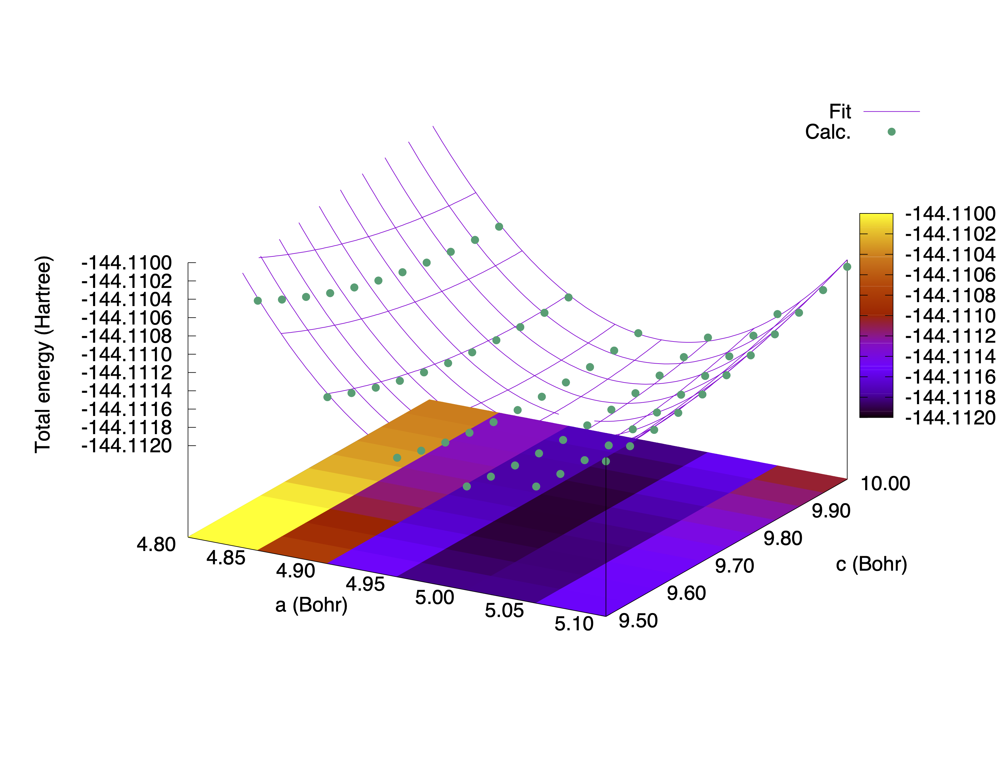

.. _tutorial_zn_hcp:

:orphan:

Zinc in the hcp structure
=========================
This tutorial explains how to optimize a crystal with more than 1 lattice parameters with STATE, by using metallic Zinc in the hcp strucutre, which has 2 lattice parameters *a* and *c*.

When the crystal has 2 or more lattice parameters, it is not a good idea to run the calculations one by one.
Rather, it is better to write a script and automate the calculations.
Here is an example of (a part of) a script::

  #
  # A list of a and c lattice parameters
  # 
  A_LIST='4.80 4.85 4.90 4.95 5.00 5.05 5.10'
  C_LIST='9.50 9.55 9.60 9.65 9.70 9.75 9.80 9.85 9.90 9.95 10.00'
  # 
  for A in ${A_LIST}
  do
  for C in ${C_LIST}
  do
  INPUT_FILE=nfinp_a${A}_c${C}
  OUTPUT_FILE=nfout_a${A}_c${C}
  cat > ${INPUT_FILE} << EOF
  #
  # Zinc in the hcp structure
  #
  NTYP     1
  NATM     2
  TYPE     0
  NSPG     194
  GMAX    6.00
  GMAXP  20.00
  KPOINT_MESH   12 12  8
  KPOINT_SHIFT    F  F  F
  BZINT TETRA
  MIX_ALPHA  0.50
  EDELTA  1.D-10
  NEG    24
  CELL ${A} ${A} ${C}  90.00000000  90.00000000 120.00000000
  &ATOMIC_SPECIES
   Zn  65.3800 pot.Zn_pbe1
  &END
  &ATOMIC_COORDINATES CRYSTAL
        0.333333333333      0.666666666667      0.250000000000    1    0    1
        0.666666666667      0.333333333333      0.750000000000    1    0    1
  &END
  EOF
  # 
  ulimit -s unlimited
  #
  # Run! 
  srun ./STATE < ${INPUT_FILE} > ${OUTPUT_FILE}
  # 
  done
  done

After a set of the calculations are finished, we may obtain total energy as a function of lattice parameters *a* and *c* as (``etot.dat``)::

  #a     c     total energy
   4.80  9.50 -144.10891213
   4.80  9.55 -144.10908308
   4.80  9.60 -144.10923859
   4.80  9.65 -144.10937412
   4.80  9.70 -144.10949480
   4.80  9.75 -144.10959790
   4.80  9.80 -144.10968517
   4.80  9.85 -144.10975838
   4.80  9.90 -144.10981718
   4.80  9.95 -144.10986204
   4.80 10.00 -144.10989506
   
   4.85  9.50 -144.11027109
   4.85  9.55 -144.11040943
   4.85  9.60 -144.11053087
   4.85  9.65 -144.11063827
   4.85  9.70 -144.11072745
   4.85  9.75 -144.11080059
   4.85  9.80 -144.11085977
   4.85  9.85 -144.11090565
   4.85  9.90 -144.11093731
   4.85  9.95 -144.11095691
   4.85 10.00 -144.11096214

   ...

We use second-order polynomial

.. math::

  f(x,y) = c_0 + c_{1} (x - x_0) + c_{2} (y - y_0) + c_{11} (x - x_0)^2 + c_{22} (y - y_0)^2 + c_{12} (x - x_0) (y - y_0)

to fit the total energy and obtain the equilibrium lattice parameters.
Total energy and the fitting function obtained are as follows:

Obtained equilibrium lattice parameters are :math:`a=2.63` (Angstrom) [:math:`a=4.977` (Bohr)] and :math:`c=5.26` (Angstrom) [:math:`c=9.948` (Bohr)], which are in good agreement with the all-electron PBE values of :math:`a=2.65` (Angstrom) and :math:`c=5.12` (Angstrom) by Wedig and co-workers [Phys. Rev. B **75**, 205123 (2007)].

Alternatively, we can perform calculations at a fixed volume, by optimizing the :math:`c/a` parameter, and obtain the total energy as a function of volume.
In this case, we optimize :math:`c/a` at the optimized (equilibrium) volume again.

